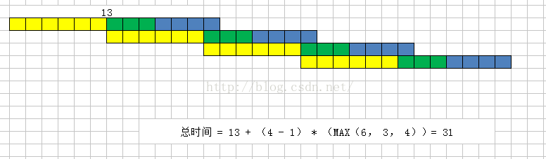
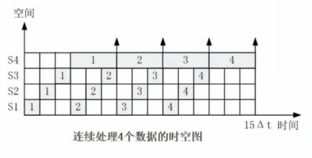
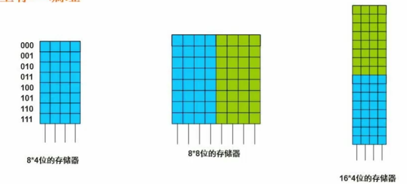
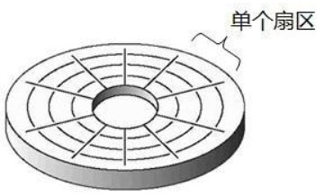
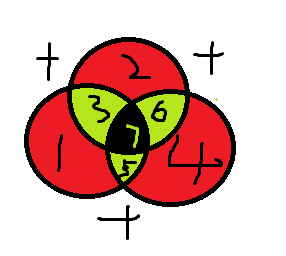

# 01 计算机体系与组成结构

## 1.1 数据的表示

### 1.1.1 原码反码补码移码

|  | 数值1 | 数值-1 | 1-1结果 |
| :---: | :---: | :---: | :---: |
| 原码 | 0000 0001 | 1000 0001 | 1000 0010 |
| 反码 | 0000 0001 | 1111 1110 | 1111 1111 |
| 补码 | 0000 0001 | 1111 1111 | 0000 0000 |
| 移码 | 1000 0001 | 0111 1111 | 1000 0000 |

原码：负数的首位是1

反码：正数的反码是原码，负数的反码是原码**除了首位取反**

补码：正数的补码是原码，负数的补码是**反码加1**

移码：正数的移码是原码首位取反，负数的移码是**补码首位取反**

原码和反码的取值范围是（$-2^{\(n-1\)}-1\sim2^{\(n-1\)}-1$），因为零有两种表示方法，

补码取值范围是（$-2^{\(n-1\)}\sim2^{\(n-1\)}-1$），正负零的补码都是0000 0000

|  | 0 | -0 |
| :---: | :---: | :---: |
| 原码 | 0000 0000 | 1000 0000 |
| 反码 | 0000 0000 | 1111 1111 |
| 补码 | 0000 0000 | 0000 0000 |

### 1.1.2 浮点数运算

浮点数的表示：

$$
N=M*R^e
$$

M是尾数，e是指数，R是基数（一般是2）。

三个步骤：

对阶-&gt;尾数计算-&gt;结果格式化

对阶的时候，尾数不能超过1位

## 1.2 CPU结构

CPU：

运算器

1. 算数逻辑单元ALU
2. 累加寄存器AC
3. 数据缓冲寄存器DR
4. 状态条件寄存器PSW

控制器

1. 程序计数器PC：
2. 指令寄存器IR
3. 时令译码器
4. 时序部件

**主机**=主存储器+CPU

## 1.3 Flynn分类

[指令流](https://baike.baidu.com/item/指令流)（Instruction Stream）——机器执行的指令序列。控制部分

[数据流](https://baike.baidu.com/item/数据流)（Data Stream）——指令调用的数据序列，包括输入数据和中间结果。处理器

单指令单数据流（Single Instruction stream and Single Data stream，SISD）：SISD其实就是传统的顺序执行的单处理器计算机，其指令部件每次只对一条指令进行译码，并只对一个操作部件分配数据。流水线方式的单处理机有时也被当成SISD。

单指令多数据流（SIMD）特性：各[处理机](https://baike.baidu.com/item/处理机)以同步的形式执行同一条指令（阵列处理机：适合数组运算）

多指令单数据流（MISD）特性：被证明不可能，至少是不实际

多指令多数据流（MIMD）特性：能够实现作业，任务，指令等各级全面并行（多处理机系统，集群系统）

## 1.4 CISC和RISC

| 指令系统 | 指令 | 寻址方式 | 实现方式 | 其它 |
| :---: | :---: | :---: | :---: | :---: |
| CISC复杂 | 数量多，频率差别大，可变长格式 | 支持多种 | 微程序控制 | 研制周期长 |
| RISC精简 | 数量少，**频率接近**，定长格式，单周期指令，操作寄存器， | 支持方式很少 | 增加了通用寄存器；硬布线逻辑控制为主：适合采用流水线 | 优化编译，有效支持高级语言 |

## 1.5 流水线

流水线：程序执行多条指令重叠进行操作的一种准并行处理实现技术。

取指-分析-执行（它们是不同的部件，空闲状态会浪费时间）可以同步执行，联想流水线上的工人。

**流水线时间以及流水线执行时间的计算**

流水线周期：执行时间最长的一段

流水线计算公式：1条指令执行时间+（指令条数-1）\*流水线周期

1. 理论公式：$\(t1+t2+...tk\)+\(n-1\)\*\Delta t$
2. 实践公式：$\(k+n-1\)\*\Delta t$     k为一条指令所包含的部分的多少

**例题：**指令流水线分为**取指、分析和执行**三部分，且三部分的时间分别是2ns，2ns，1ns。那么，流水线周期是多少？100条指令执行时间完毕？

**解答：**最耗时的时间2ns，执行时间是5+99\*2=203ns 根据实践公式，T=（3+100-1）\*2=204ns

**流水线的加速比**

流水线的加速比指的是在完成同一批任务时，不使用流水线所用的时间与使用流水线所用的时间之比称之为流水下的加速比。加速比是越大越好的，它呈现了使用流水线的效果的好坏程度。

基本公式为：S=不使用流水线执行时间 / 使用流水线的执行时间

题目中 $S=\(2+2+1\)_100/\(5+99_2\)=2.463$

**流水线的效率**

流水线的效率指的是流水线的设备利用率。在时空图上，流水线的效率定义为n个任务占用的时空与k个流水线总的时空区之比。

$$
E=\frac{n个任务占用的时空区}{k个流水段的总的时空区}
$$

**流水线吞吐率**

流水线的吞吐率指的是在**单位时间内流水线所完成的任务数量**或输出的结果数量。基本公式为：

$TP=指令条数/流水线执行时间$

$TP\_{max}=1/\Delta t$

## 1.6 层次化存储结构

CPU 寄存器 容量很小，速度很快

Cache 按内容存取 高速缓存，非必须

内存

外存 硬盘、光盘、U盘

## 1.7 Cache

提高CPU数据输入输出的速率，突破冯·诺伊曼的瓶颈，CPU与存储系统间数据传送带宽限制。

$$
t_3=h\times t_1+(1-h)\times t_2
$$

h：表示缓存访问命中率

$t\_1$：表示缓存的周期时间

$t\_2$：表示主存储器的周期时间

$t\_3$：表示系统的**平均周期**

## 1.8 局部性原理

时间局部性：被引用过一次的存储器位置在未来会被多次引用（通常在循环中）。

空间局部性：如果一个存储器的位置被引用，那么将来他附近的位置也会被引用。

工作集理论：工作集是进程运行时被频繁访问的页面集合

## 1.9 主存

随机存储存储器：RAM 掉电易失性

制度存储器：ROM

主存的编址：地址单元和存储单元

地址单元就是逻辑上的格子，每个格子都有编号，编号就是**内存的地址**，地址和格子空间是一一对应且永久绑定的。内存一般以字节\(8位\)或字\(字的长度可大可小，16位、32位等\)为单位。

存储单元是物理格子，总的位数要对应。

**例题1：**从`AC000H`到`C7FFFH`，**相减再加1**，可以计算得到地址单元

C8000H-AC000H=1C000H=0001 1100 0000 0000 0000=2^16+2^15+2^14

1C000H/\(2^10\)=2^6+2^5+2^4=64+32+16=112K**个地址单元**

**再问：**如果该内存按字（16bit）编址，28位存储器芯片构成。已知构成此芯片每篇有16K个存储单元，则该芯片每个存储单元存储（）位。

$$
112K\times 16=28\times 16K x
$$

每个存储单元存储4位

**例题2：**如果主存容量为16M字节，且按字节编址，表示该主存地址至少应需要\_\_位。

按字节编址表示一个地址占用一个字节，

16M字节=$2^4\*2^{20}$=$2^{24}$个字节，因此主存地址需要有24位才可以。

**例题3：**若内存按字节编址，用存储容量为32K×8比特的存储器芯片构成地址编号A0000H 至DFFFFH的内存空间，则至少需要\_\_片。

地址空间：E00000H-A0000H=40000H=0100 0000 0000 0000 0000 = 2^18

地址单元：2^8K=256K

总的位数：256K\*8

芯片个数：\(256\*8\)/\(32\*8\)=8

**例题4：**内存按字节编址，地址从A4000H到CBFFFH，共有多少字节?若用存储容量为32K\*8bit 的存储器芯片构成该内存，至少需要多少片

地址空间：CC000H-A4000H=28000H=0010 1000 0000 0000 0000=2^17+2^15

地址单元：2^7+2^5K=128+32K=160K

总的位数：160K\*8

芯片个数：\(160\*8\)/\(32\*8\)=5

## 1.10 磁盘

磁盘的结构与参数

磁盘包含多个**盘片**，用于存储数据。中间有一个**主轴**，所有的盘片都绕着这个主轴转动。

一个**组合臂**上面有多个磁头臂，每个磁头臂上面都有一个**磁头**，负责读写数据。

**磁道 \(Track\)：**每个盘片的盘面被划分成多个狭窄的同心圆环，数据就存储在这样的同心圆环上面。每个盘面可以划分多个磁道，最外圈的磁道是0号磁道，向圆心增长依次为1磁道、2磁道…磁盘的数据存放就是从最外圈开始的。

**扇区（Sector）：**根据硬盘的规格不同，**磁道数**可以从几百到成千上万不等。每个磁道可以存储数Kb的数据，但是计算机不必要每次都读写这么多数据。因此，再把每个**磁道划分为若干个弧段**，每个弧段就是一个**扇区 \(Sector\)**。扇区是硬盘上存储的物理单位，现在每个扇区可存储 512 字节数据已经成了业界的约定。也就是说，即使计算机只需要某一个字节的数据，但是也得把这个 512 个字节的数据全部读入内存，再选择所需要的那个字节。

**柱面：**是我们抽象出来的一个逻辑概念，简单来说就是处于同一个垂直区域的磁道称为柱面 ，即各盘面上面相同位置磁道的集合。数据的读写是按**柱面**进行的，而不是按盘面进行，所以把数据存到同一个柱面是很有价值的。

磁盘被**磁盘控制器**所控制（可控制一个或多个），它是一个小处理器，可以完成一些特定的工作。比如将磁头定位到一个特定的半径位置；从磁头所在的柱面选择一个扇区；读取数据等。

存取时间=寻道时间+等待时间（平均定位时间+转动延迟）

寻道时间：磁头移动到磁道所需的时间

等待时间：等待读写的扇区转到磁头下方所用的时间

**例题：**一个圆环磁道上有10个物理块，10个数据记录R1~R10存放在这个磁道上，记录的安排顺序如下表所示。

| 物理块 | 1 | 2 | 3 | 4 | 5 | 6 | 7 | 8 | 9 | 10 |
| :--- | :--- | :--- | :--- | :--- | :--- | :--- | :--- | :--- | :--- | :--- |
| 逻辑记录 | R1 | R2 | R3 | R4 | R5 | R6 | R7 | R8 | R9 | R10 |

假设磁盘的旋转速度为20ms，磁盘当前处在R1的开头处，若系统顺序扫描后将数据放入单缓冲区内，处理数据的时间为4ms（然后再读取下个记录），则处理这10个记录的最长时间是多少？

**解题：磁盘会一直朝某个方向旋转，不会因为处理数据而停止。**

起始位置在 R1，一周是 20ms，共 10 个记录，所以每个记录的读取时间为 2ms。

首先读 R1 并处理 R1，读 R1 花 2ms，读好后磁盘处于 R1 的末尾或 R2 的开头，此时处理 R1，需要 4ms，因为磁盘一直旋转，所以 R1 处理好了后磁盘已经转到 R4 的开始了，这时花的时间为 2+4=6ms。

然后处理R2，需要等待磁盘从 R5 一直转到 R2 的开始才行，磁盘转动不可反向，所以要经过 **8\*2ms** 才能转到 R1 的末尾，读取 R2 需要 **2ms**，再处理 R2 需要 **4ms**，处理结束后磁盘已经转到 R5 的开头了，这时花的时间为 2\*8+2+4=22ms。

读取并处理后序记录都为 22ms，所以总时间为 6+22\*9=**204ms**。

## 1.11 总线

总线（Bus），是指计算机设备和设备之间传输信息的公共数据通道。

根据所处的位置不同：

* 内部总线：芯片级别
* 系统总线：数据总线，地址总线，控制总线
* 外部总线：外部设备

**数据总线DB**用来传送数据信息，是双向的。CPU既可通过DB从内存或输入设备读入数据，又可通过DB将内部数据送至内存或输出设备。DB的宽度决定了CPU和计算机其他设备之间每次交换数据的位数。

**地址总线AB**用于传送CPU发出的地址信息，是单向的。传送地址信息的目的是指明与CPU交换信息的内存单元或I/O设备。存储器是按地址访问的，所以每个 存储单元都有一个固定地址，要访问1MB存储器中的任一单元，需要给出1M个地址，即需要20位地址（2^20=1M）。因此，地址总线的宽度决定了CPU 的最大寻址能力。

**控制总线CB**用来传送控制信号、时序信号和状态信息等。其中有的是CPU向内存或外部设备发出的信息，有的是内存或外部设备向CPU发出的信息。显然，CB中的每一条线的信息传送方向是一定的、单向的，但作为一个整体则是双向的。所以，在各种结构框图中，凡涉及到控制总线CB，均是以双向线表示。

## 1.10 系统可靠性分析：串联和并联

串联系统的可靠性：

$$
R=R_1\times R_2\times ...\times R_n
$$

并联系统的可靠性：

$$
R=1-1(1-R_1)\times (1-R_2)\times ...\times(1-R_n) \\
$$

冗余系统与混合系统：

为增加系统的可靠性，而采取两套或两套以上相同、相对独立配置的设计。

## 1.11 差错控制-CRC与海明校验码

检错和纠错？

**码距：**

一个编码系统的码距是整个编码系统中**任意两个码字**的最小距离。

**例题：**

若用1位长度的二进制编码。若A=1，B=0。这样A，B之间的最小码距为1。

若用2位长度的二进制编码。若A=11，B=00。这样A，B之间的最小码距为2。

若用3位长度的二进制编码。若A=111，B=000。这样A，B之间的最小码距为3。

**码距与检错、纠错**有何关系？

1. 在一个码组为了检测e个误码，要求最小的码距d应该满足：d&gt;e+1
2. 在一个码组为了纠正t个误码，要求最小的码距d应该满足：d&gt;2t+1

## 1.12 CRC循环校验码

模2除法，除法不进位

原始报文+生成多项式：进行模2算法，原始报文补零（多项式位数-1）

原始报文+结果是编码后的结果，然后模多项式应该是0

**例题：**假设原始报文11001010101，生成多项式$x^4+x^3+x+1$。进行生成多项式编码后的结果是：

$$
\begin{array}{lr} 
&  \\ 
11011   & \overline{)110010101010000} \\ 
& \underline{11011\ \ \ \ \ \ \ \ \ \ \ \ \ \ \ \ \ \ \ \ } \\ 
& 10010\ \ \ \ \ \ \ \ \ \ \ \ \ \ \\
& \underline{11011\ \ \ \ \ \ \ \ \ \  \ \ \ \ } \\ 
& 10011 \ \ \ \ \ \ \ \ \ \ \ \ \\
& \underline{11011\ \ \ \ \ \ \ \ \ \ \ \ } \\
& 10000 \ \ \ \ \ \ \ \ \  \ \\
& \underline{11011\ \ \ \ \ \ \ \ \  \ } \\
& 10111\ \ \ \ \ \ \ \  \\
& \underline{11011 \ \ \ \ \ \ \ \  } \\
& 11000\ \ \ \ \ \  \\
& \underline{11011\ \ \ \ \ \  } \\
& 11000  \\
& \underline{11011} \\
& 0011
\end{array}
$$

于是编码后的结果：110010101010011

## 1.13 海明校验码

[参考](https://www.cnblogs.com/godoforange/p/12003676.html)

简介：海明码（Hamming Code）是由贝尔实验室的Richard Hamming 设计的，它也是利用奇偶性来检错和纠错的检验方法。

假设1011

1. 确定校验码的位数

   假设数据有n位，校验码有x位。则校验码有2^x种取值方式。其中需要一种取值方式表示数据正确，剩下2x-1种取值方式表示有一位数据出错。

   因此编码后的二进制串有n+x位，因此x应该满足：

   $$
   2^x-1\ge n+x
   $$

   需要找出使得不等式成立的最小值。

2. 确定校验位的位置，求出校验位的值

   校验位取2的n次幂，剩下的位置是数据。

   | 7 | 6 | 5 | 4 | 3 | 2 | 1 | 位数 |
   | :---: | :---: | :---: | :---: | :---: | :---: | :---: | :---: |
   | 1 | 0 | 1 |  | 1 |  |  | 信息位 |
   |  |  |  | $r\_2$ |  | $r\_1$ | $r\_0$ | 校验位 |

3. 分组

   确认校验位校验的位置：

   1. 写出1，2，4的二进制码（x位）

      | 1 | 2 | 4 |
      | :---: | :---: | :---: |
      | 001 | 010 | 100 |

   2. 然后我们将0替换为\*，作为通配表：

      | 1 | 2 | 4 |
      | :---: | :---: | :---: |
      | \*\*1 | \*1\* | 1\*\* |

   3. 列出来1到7的二进制序列：

      | 7 | 6 | 5 | 4 | 3 | 2 | 1 |
      | :---: | :---: | :---: | :---: | :---: | :---: | :---: |
      | 111 | 110 | 101 | 100 | 011 | 010 | 001 |

   4. **匹配：**

      | 1 | 2 | 4 |
      | :---: | :---: | :---: |
      | \*\*1 | \*1\* | 1\*\* |
      | 001（1） | 010（2） | 100（4） |
      | 011（3） | 011（3） | 101（5） |
      | 101（5） | 110（6） | 110（6） |
      | 111（7） | 111（7） | 111（7） |

4. 求出校验位：

   r0 负责 1 3 5 7 位数的校验 r1 负责 2 3 6 7 位数的校验 r4 负责 4 5 6 7 位数的校验

   | 7 | 6 | 5 | 4 | 3 | 2 | 1 | 位数 |
   | :---: | :---: | :---: | :---: | :---: | :---: | :---: | :---: |
   | 1 | 0 | 1 |  | 1 |  |  | 信息位 |
   |  |  |  | $r\_2$ |  | $r\_1$ | $r\_0$ | 校验位 |

   利用偶校验：

   r3,r5,r7 1的个数是奇数，因此r1=1

   r3,r6,r7 1的个数是偶数，因此r2=0

   r5,r6,r7 1的个数是偶数，因此r4=0

   | 7 | 6 | 5 | 4 | 3 | 2 | 1 | 位数 |
   | :---: | :---: | :---: | :---: | :---: | :---: | :---: | :---: |
   | 1 | 0 | 1 | 0 | 1 | 0 | 1 | 信息位 |

5. 查错：

   每个分组的1的位数都是偶数，如果偶校验不通过则出错。比方说r1,r3,r5,r7是1111，变成了1110，则出错。

6. **纠错：**

   只能**纠正一位**错误，上图：

   

   如果在 1 3 7 5 这个区域偶校验出错，那么一定是 1 3 7 5 这四个位置中的一个位置出错：

   * 如果此时其他的俩个组 即：2，3，6，7 和 4，5，6，7偶校验都通过了的话。

     也就证明只可能**是1出**错

   * 但是如果2，3，5，7这个位置也出错了，4，5，6，7这个位置没有出错。

     我们很容易就推导出，**是 3 这个位置**出错了。

   以此类推：当我们把1,3,5,7 设为P1，2,3,6,7设为P2，4,5,6,7设为P3时

   | P3 | P2 | P1 | 出错\(第几\)位数 |
   | :---: | :---: | :---: | :---: |
   | 0 | 0 | 1 | 1 |
   | 0 | 1 | 0 | 2 |
   | 0 | 1 | 1 | 3 |
   | 1 | 0 | 0 | 4 |
   | 1 | 0 | 1 | 5 |
   | 1 | 1 | 0 | 6 |
   | 1 | 1 | 1 | 7 |

五位数类似 ↑

