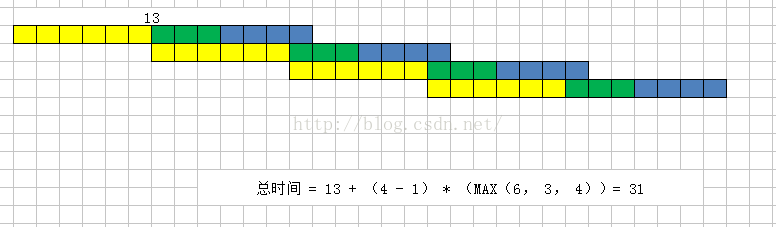
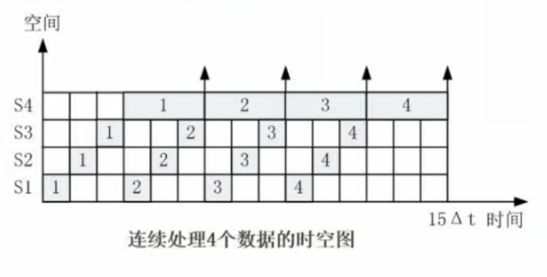
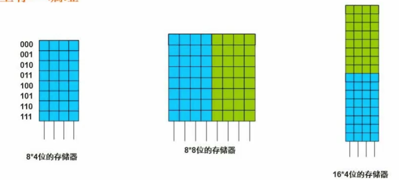

# 01 计算机体系与组成结构

## 1.1 数据的表示

### 1.1.1 原码反码补码移码

|      |   数值1   |  数值-1   |  1-1结果  |
| :--: | :-------: | :-------: | :-------: |
| 原码 | 0000 0001 | 1000 0001 | 1000 0010 |
| 反码 | 0000 0001 | 1111 1110 | 1111 1111 |
| 补码 | 0000 0001 | 1111 1111 | 0000 0000 |
| 移码 | 1000 0001 | 0111 1111 | 1000 0000 |

原码：负数的首位是1

反码：正数的反码是原码，负数的反码是原码**除了首位取反**

补码：正数的补码是原码，负数的补码是**反码加1**

移码：正数的移码是原码首位取反，负数的移码是**补码首位取反**

原码和反码的取值范围是（$-2^{(n-1)}-1\sim2^{(n-1)}-1$），因为零有两种表示方法，

补码取值范围是（$-2^{(n-1)}\sim2^{(n-1)}-1$），正负零的补码都是0000 0000

|      |     0     |    -0     |
| :--: | :-------: | :-------: |
| 原码 | 0000 0000 | 1000 0000 |
| 反码 | 0000 0000 | 1111 1111 |
| 补码 | 0000 0000 | 0000 0000 |

### 1.1.2 浮点数运算

浮点数的表示：
$$
N=M*R^e
$$
M是尾数，e是指数，R是基数（一般是2）。

三个步骤：

对阶->尾数计算->结果格式化

对阶的时候，尾数不能超过1位

## 1.2 CPU结构

CPU：

运算器

1. 算数逻辑单元ALU
2. 累加寄存器AC
3. 数据缓冲寄存器DR
4. 状态条件寄存器PSW

控制器

1. 程序计数器PC：
2. 指令寄存器IR
3. 时令译码器
4. 时序部件

**主机**=主存储器+CPU

## 1.3 Flynn分类

[指令流](https://baike.baidu.com/item/指令流)（Instruction Stream）——机器执行的指令序列。控制部分

[数据流](https://baike.baidu.com/item/数据流)（Data Stream）——指令调用的数据序列，包括输入数据和中间结果。处理器

单指令单数据流（Single Instruction stream and Single Data stream，SISD）：SISD其实就是传统的顺序执行的单处理器计算机，其指令部件每次只对一条指令进行译码，并只对一个操作部件分配数据。流水线方式的单处理机有时也被当成SISD。

单指令多数据流（SIMD）特性：各[处理机](https://baike.baidu.com/item/处理机)以同步的形式执行同一条指令（阵列处理机：适合数组运算）

多指令单数据流（MISD）特性：被证明不可能，至少是不实际

多指令多数据流（MIMD）特性：能够实现作业，任务，指令等各级全面并行（多处理机系统，集群系统）

## 1.4 CISC和RISC

| 指令系统 |                           指令                           |   寻址方式   |                       实现方式                       |            其它            |
| :------: | :------------------------------------------------------: | :----------: | :--------------------------------------------------: | :------------------------: |
| CISC复杂 |              数量多，频率差别大，可变长格式              |   支持多种   |                      微程序控制                      |         研制周期长         |
| RISC精简 | 数量少，**频率接近**，定长格式，单周期指令，操作寄存器， | 支持方式很少 | 增加了通用寄存器；硬布线逻辑控制为主：适合采用流水线 | 优化编译，有效支持高级语言 |

## 1.5 流水线

流水线：程序执行多条指令重叠进行操作的一种准并行处理实现技术。

取指-分析-执行（它们是不同的部件，空闲状态会浪费时间）可以同步执行，联想流水线上的工人。

**流水线时间以及流水线执行时间的计算**

流水线周期：执行时间最长的一段

流水线计算公式：1条指令执行时间+（指令条数-1）*流水线周期

1. 理论公式：$(t1+t2+...tk)+(n-1)*\Delta t$
2. 实践公式：$(k+n-1)*\Delta t$     k为一条指令所包含的部分的多少

**例题：**指令流水线分为**取指、分析和执行**三部分，且三部分的时间分别是2ns，2ns，1ns。那么，流水线周期是多少？100条指令执行时间完毕？

**解答：**最耗时的时间2ns，执行时间是5+99\*2=203ns   根据实践公式，T=（3+100-1）\*2=204ns

**流水线的加速比**

流水线的加速比指的是在完成同一批任务时，不使用流水线所用的时间与使用流水线所用的时间之比称之为流水下的加速比。加速比是越大越好的，它呈现了使用流水线的效果的好坏程度。

基本公式为：S=不使用流水线执行时间 / 使用流水线的执行时间

题目中 $S=(2+2+1)*100/(5+99*2)=2.463$

**流水线的效率**

流水线的效率指的是流水线的设备利用率。在时空图上，流水线的效率定义为n个任务占用的时空与k个流水线总的时空区之比。
$$
E=\frac{n个任务占用的时空区}{k个流水段的总的时空区}
$$

**流水线吞吐率**

流水线的吞吐率指的是在**单位时间内流水线所完成的任务数量**或输出的结果数量。基本公式为：  

$TP=指令条数/流水线执行时间$

$TP_{max}=1/\Delta t$

## 1.6 层次化存储结构

CPU			寄存器						容量很小，速度很快

Cache		按内容存取				 高速缓存，非必须

内存

外存			硬盘、光盘、U盘

## 1.7 Cache

提高CPU数据输入输出的速率，突破冯·诺伊曼的瓶颈，CPU与存储系统间数据传送带宽限制。
$$
t_3=h\times t_1+(1-h)\times t_2
$$
h：表示缓存访问命中率

$t_1$：表示缓存的周期时间

$t_2$：表示主存储器的周期时间

$t_3$：表示系统的**平均周期** 

## 1.8 局部性原理

时间局部性：被引用过一次的存储器位置在未来会被多次引用（通常在循环中）。

空间局部性：如果一个存储器的位置被引用，那么将来他附近的位置也会被引用。

工作集理论：工作集是进程运行时被频繁访问的页面集合

## 1.9 主存

随机存储存储器：RAM 掉电易失性

制度存储器：ROM

主存的编址：地址单元和存储单元

地址单元就是逻辑上的格子，每个格子都有编号，编号就是**内存的地址**，地址和格子空间是一一对应且永久绑定的。内存一般以字节(8位)或字(字的长度可大可小，16位、32位等)为单位。

存储单元是物理格子，总的位数要对应。

**例题1：**从`AC000H`到`C7FFFH`，**相减再加1**，可以计算得到地址单元

C8000H-AC000H=1C000H=0001 1100 0000 0000 0000=2^16+2^15+2^14

1C000H/(2^10)=2^6+2^5+2^4=64+32+16=112K**个地址单元**

**再问：**如果该内存按字（16bit）编址，28位存储器芯片构成。已知构成此芯片每篇有16K个存储单元，则该芯片每个存储单元存储（）位。
$$
112K\times 16=28\times 16K x
$$
每个存储单元存储4位

**例题2：**如果主存容量为16M字节，且按字节编址，表示该主存地址至少应需要__位。

按字节编址表示一个地址占用一个字节，

16M字节=$2^4*2^{20}$=$2^{24}$个字节，因此主存地址需要有24位才可以。

**例题3：**若内存按字节编址，用存储容量为32K×8比特的存储器芯片构成地址编号A0000H 至DFFFFH的内存空间，则至少需要__片。

地址空间：E00000H-A0000H=40000H=0100 0000 0000 0000 0000 = 2^18

地址单元：2^8K=256K

总的位数：256K*8

芯片个数：(256\*8)/(32\*8)=8

**例题4：**内存按字节编址，地址从A4000H到CBFFFH，共有多少字节?若用存储容量为32K*8bit 的存储器芯片构成该内存，至少需要多少片

地址空间：CC000H-A4000H=28000H=0010 1000 0000 0000 0000=2^17+2^15

地址单元：2^7+2^5K=128+32K=160K

总的位数：160K*8

芯片个数：(160*8)/(32\*8)=5

