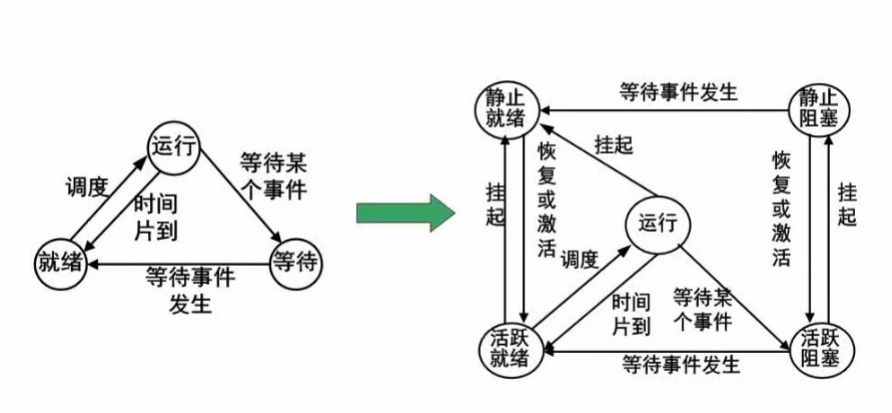
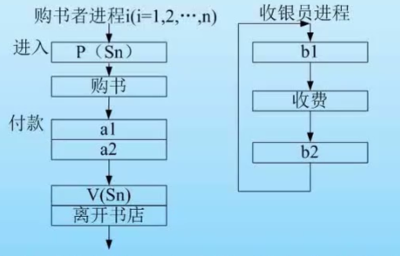
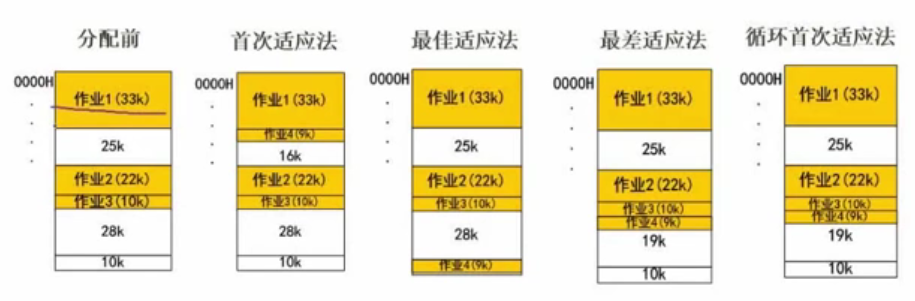
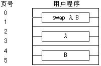
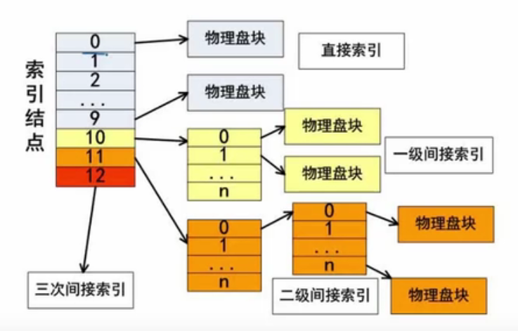
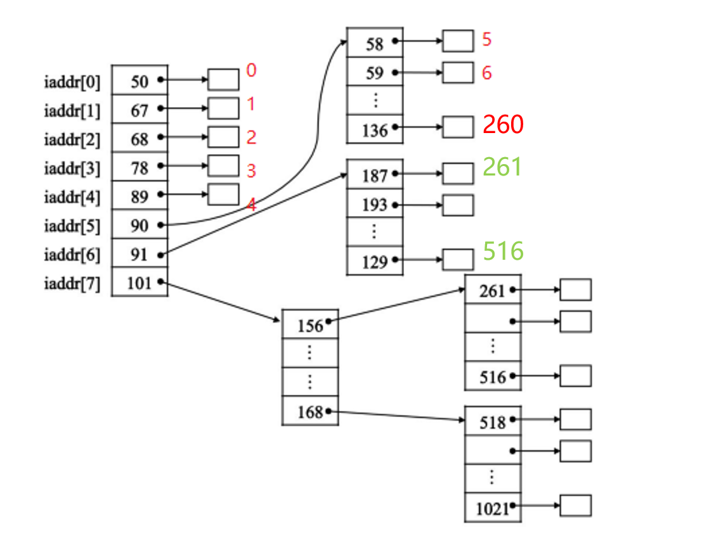
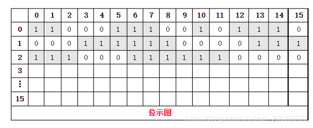

# 02 操作系统基本原理

## 1.1 概述

操作系统（Operating System，简称OS）是一管理电脑硬件与软件资源的程序，同时也是计算机系统的内核与基石。

1. 通过资源管理提高计算机系统的效率；
2. 改善人机界面向用户提供友好的工作环境；

操作系统的主要功能：

1. **进程管理**：主要是对处理机进行管理。   

2. **存储管理**：主要是对内存的分配、保护和扩充。   

3. **设备管理**：对所有输人、输出设备的管理。  

4. **文件管理**：主要涉及文件的逻辑组织和物理组织，目录的结构和管理。  

5. **作业管理**：为用户提供一个友好的环境，方便用户组织自己的工作流程。

## 1.2 进程

### 1.2.1 进程状态



### 1.2.2 前趋图

**例题：**

画出下面4条语句的前趋图（符号“:=”是赋值的意思）
S1：a：=x+y
S2：b：=z+1
S3：c：=a-b
S4：w：=c+1

**分析：**
S1与S2可以并发执行，因为它们互不依赖；但是S3必须在a（S1）、b（S2）被赋值后才能执行，S4必须在c（S3）之后才能执行。

**结果：**

```text
s1 ↘
     s3 -> s4
s2 ↗
```

### 1.2.3 进程的同步与互斥

互斥是通过竞争对资源的独占使用，彼此之间不需要知道对方的存在，执行乱序。同步是协调多个相互关联线程合作完成任务，彼此之间知道对方存在，执行顺序往往是有序的。

互斥：是指散步在不同任务之间的若干程序片断，当某个任务运行其中一个程序片段时，其它任务就不能运行它们之中的任一程序片段，只能等到该任务运行完这个程序片段后才可以运行，最基本的场景就是对资源的同时写，为了保持资源的一致性，往往需要进行互斥访问。
同步：是指散步在不同任务之间的若干程序片断，它们的运行必须严格按照规定的某种先后次序来运行，这种先后次序依赖于要完成的特定的任务，最基本的场景就是任务之间的依赖，比如A任务的运行依赖于B任务产生的数据。

## 1.3 PV操作

进程状态之间的**转换**就是靠PV操作来控制的。PV操作主要就是**P操作、V操作和信号量**。其中信号量起到了至关重要的作用。

**概念：**

- **临界资源：**进程间需要互斥的方式进行访问的资源

- **临界区：**    进程种访问临界资源的**代码段**
- **信号量：**    是一种特殊（专用于pv操作）的变量，信号量（Saphore）由一个值和一个指针组成，指针指向等待该信号量的进程。信号量的值表示相应资源的使用情况。

注意，信号量的值只能由PV操作来改变。


**P操作：**

- 执行一次P操作意味着请求分配一个资源，因此S的值减1；
- 如果S>=0，则该程序继续执行。否则，该进程置为**等待状态**，排入等待队列。

**V操作：**

- 执行一个V操作意味着释放一个资源，因此S的值加1；

- 如果S>0，则该程序继续执行。否则，释放等待队列中**第一个等待信号量**的进程。

**模型：**

单缓冲区生产者、消费者问题PV原语描述：

S1初值为1，S2初值为0

|     生产者     |      消费者      |
| :------------: | :--------------: |
|  生产一个产品  |      P(s2)       |
|     P(s1)      | 从缓冲区取出产品 |
| 产品送入缓冲区 |      V(s1)       |
|     V(s2)      |     消费产品     |


| 生产者                                       | 消费者                                            |
| :------------------------------------------- | :------------------------------------------------ |
| 生产了一个产品                               | P(S2) : S2 = 1 - 1 = 0 >= 0 : 继续执行            |
| P(S1) : S1=1 - 1 = 0 >= 0 : 继续执行         | 从缓冲区取出产品                                  |
| 产品送入缓冲区                               | V(S1) : S1 = -1 + 1 = 0 <= 0 : 释放**生产者进程** |
| V(S2) : S2=0 + 1 = 1 > 0  : 继续执行         |                                                   |
| 生产了一个产品                               |                                                   |
| P(S1) : S1=0 - 1 = -1 < 0 : 进程进入等待队列 |                                                   |
|                                              |                                                   |


**例题：**

某书店有一个收银员，该书店最多允许n个购书者的进入。将收银员和购物者看作不同的进程。其工作流程如下图所示，利用**PV操作**实现该过程，设置信号量s1，s2和sn，初值分别为0，0，n。则图中a1，a2应该填入（），图中b1，b2应该填入（）。



>**P操作：**
>
>- 执行一次P操作意味着请求分配一个资源，因此S的值减1；
>- 如果S>=0，则该程序继续执行。否则，该进程置为**等待状态**，排入等待队列。
>
>**V操作：**
>
>- 执行一个V操作意味着释放一个资源，因此S的值加1；
>
>- 如果S>0，则该程序继续执行。否则，释放等待队列中**第一个等待信号量**的进程。
>
>**PV操作是一套， P相当于提出请求， V则是执行请求后给的响应。**

- 购书者付费——需要收银员操作（存在制约关系，如：收银员不在收银台或者在睡觉，需要购书者唤醒）。v(s1) p(s1)
- 购书者离开书店——需要收银员将书消磁和开发票——购书者需要出示发票通过门禁——才能正常合法离开书店。p(s2) v(s2)


## 1.4 pv操作和前趋图

前趋图 箭头的起始值是V，终点是P

A：V(Sa)，B：V(Sb)，C(Sc)

D：P(Sa、Sb、Sc)+V(Sd)

E：P(Sd)

```
A 
   ↘
B  ->  D -> E
   ↗
C 
```


## 1.5 死锁

如果一个进程等待一件**不可能发生的事情**，就会造成死锁。

🌰：系统有3个进程：A，B，C都需要5个系统资源，如果系统至少有多少个资源，就**不可能**发生死锁：

每个进程都差一个资源，只要再有一条资源就不会死锁

4 * 3 + 1 = 13

## 1.6 死锁的预防和避免

死锁的四大条件：

- 互斥使用资源
- 保持（自己的资源）和等待（释放更改更多的资源）
- 剥夺（不会主动剥夺某个进程的资源）
- 环路等待（互相等待释放资源）

死锁预防：打破四大条件

死锁避免：

- 有序分配资源
- 银行家算法

银行家算法：

**例题：**假设系统中有三类互斥资源R1，R2和R3，可用资源数分别为9，8和5。在T0时刻系统中有P1，P2，P3，P4和P5五个进程，这些进程对资源的最大需求量和已分配资源数如表所示。如果进程按（）序列执行，那么系统状态是安全的。

|      |        最大需求量         |       已分配资源数        |      还需要的资源数       |
| :--: | :-----------------------: | :-----------------------: | :-----------------------: |
|      |  R1        R2        R3   |  R1        R2        R3   |  R1        R2        R3   |
|  P1  | 6           5           2 | 1           2           1 | 5           3           1 |
|  P2  | 2           2           1 | 2           1           1 | 0           1           0 |
|  P3  | 8           1           1 | 2           1           0 | 6           0           1 |
|  P4  | 1           2           1 | 1           2           0 | 0           0           1 |
|  P5  | 3           4           4 | 1           1           3 | 2           3           1 |

此时剩下的总的资源数（R1 R2 R3）=（2 1 0），做法是优先满足能满足的，这样就会释放更多的资源。

因此：P2（4 2 1）-> P4（5 4 1) -> P1（6 6 2）-> P3（8 7 2）-> P4（9 8 5）

（答案不唯一）


## 1.7 存储管理

### 1.7.1 分区存储组织

**例题：**某计算机内存的大小为128K，采用可变分区分配方式进行内存分配，当前系统的内存分化情况如图所示，现有作业4是申请内存9K。几种不同的存储分配算法在分配中，会产生什么样的结果呢？



几种不同的作业组织：

- 首次适应法：按顺序分配；

- 最佳分配法：将空间大小按序排列，选取最小最适合的空间。【缺陷】内存碎片会很多；

- 最差适应法：将空间大小按序排列，选取最大的空间；

- 循环首次适应法：空间排序，按顺序选取空间分配。

### 1.7.2 非连续分配管理方式

> 分区式存储管理最大的缺点是**碎片问题严重**，内存利用率低。究其原因，主要在于连续分配的限制，即它要求每个作用在内存中必须占一个连续的分区。

**页式存储**

1. 将整个系统的内存空间划分成一系列**大小相等的块**，所有的块按物理地址递增顺序连续编号为0、1、2、……。
2. 每个作业的地址空间也划分成一系列与内存块一样大小的块，每一块称为一个**逻辑页**或**虚页**，也有人叫**页面**，可简称为**页（page）**。所有的页按照逻辑地址递增顺序连续编号为0、1、2、……。
3. 一个作业，只要它的总页数不大于内存中的可用块数，系统就可以对它实施分配。系统装入作业时，以页为单位分配内存，一页分配一个块，作业所有的页所占的块可以不连续。系统同时为这个作业建立一个页号与块号的对照表，称为**页表**。
4. 每个块的大小是固定的，一般是个1/2KB～4KB之间的数值，而且必须是个2的幂次。

**例题：**进程P有6个页面，页号分别为0～5，页面大小为4K，页面变换表如下所示。表中状态位等于1和0分别表示页面在内存和不在内存。假设系统给进程P分配了4个存储块，进程P要访问的逻辑地址为十六进制5A29H，那么该地址经过变换后，其**物理地址**应为十六进制（）  ；如果进程P要访问的页面4不在内存，那么应该淘汰页号为（）的页面。

| 页面 | 页帧号 | 状态位 | 访问位 | 修改位 |
| :--: | :----: | :----: | :----: | :----: |
|  0   |   2    |   1    |   1    |   0    |
|  1   |   3    |   1    |   0    |   1    |
|  2   |   5    |   1    |   1    |   0    |
|  3   |   -    |   0    |   0    |   0    |
|  4   |   -    |   0    |   0    |   0    |
|  5   |   6    |   1    |   1    |   1    |

**解答：**

1. 分离逻辑页号和逻辑业内地址：

   页面大小4k=2^12，说明**页内位数**是12。高于12的部分是页号，因此A29代表**页内地址**，5是**页号**。

   5对应的页帧号是6，因此答案是6A29H

2. 访问页面4（0代表不在内存，只能需要淘汰在内存的，访问位是0的），

   因此答案是1

**段式存储**

> 采用分页内存管理有一个不可避免的问题：用户视角的内存和实际物理内存的分离。用户通常更愿意将内存看做是一组**不同长度的段的集合，这些段之间并没有一定的顺序**

段的大小不固定（相比页）

逻辑空间由一组段组成，每个段有自己的**名称和长度**。在段式管理策略中，地址指定了段号和段内偏移，因此**用户通过两个量来指定地址：段号+偏移（基址）**

段页式存储：结合两者

快表：速度很快，效率很高，友告诉缓存器组成。


### 1.7.3 页面置换算法

- 最优算法：从主存中移出永远不再需要的页面；如无这样的页面存在，则选择最长时间不需要访问的页面。于所选择的被淘汰页面将是以后永不使用的，或者是在最长时间内不再被访问的页面，这样可以保证获得最低的缺页率。

- 随机算法

- 先入先出：是最简单的页面置换算法。这种算法的基本思想是：当需要淘汰一个页面时，总是选择驻留主存时间最长的页面进行淘汰，即先进入主存的页面先淘汰。其理由是：最早调入主存的页面不再被使用的可能性最大。 

- 最近最少使用（LRU）：利用局部性原理，根据一个作业在执行过程中过去的页面访问历史来推测未来的行为。它认为过去一段时间里不曾被访问过的页面，在最近的将来可能也不会再被访问。所以，这种算法的实质是：当需要淘汰一个页面时，总是选择在最近一段时间内**最久不用的页面**予以淘汰。 

**例题：**

在一个虚存系统中，进程的内存空间为3页，开始内存为空，有以下访问页序列：5 0 1 2 0 3 0 4 2 3 0 3 2 1 2 0 1 5 0 1。分别计算缺页次数。

1. 使用先进先出算法
2. 使用最佳适应算法
3. 使用最近最少使用算法。

||5|0|1|2|0|3|0|4|2|3|0|3|2|1|2|0|1|5|0|1|
| :----: | :----: | :----: | :----: | :----: | :----: | :----: | :----: | :----: | :----: | :----: | :----: | :----: | :----: | :----: | :----: | :----: | :----: | :----: | :----: | :----: |
| FIFO | √ | √ | √ | √ |      | √ | √ | √ | √ | √ | √ |      |      | √ | √ |      |      | √ | √ | √ |
| 淘汰 |      |      |      | 5 |      | 0 | 1 | 2 | 3 | 0 | 4 |      |      | 2 | 3 |      |      | 0 | 1 | 2 |
| LRU  | √ | √ | √ | √ |      | √ |      | √ | √ | √ | √ |      |      | √ |      | √ |      | √ |      |      |
| 淘汰 |      |      |      | 5 |      | 1 |      | 2 | 3 | 0 | 4 |      |      | 0 |      | 3 |      | 2 |      |      |


### 1.7.4 习题

**例题：**在一台按**字节**编址的8位计算机系统中，采用虚拟页式存储管理方案，**页面的大小为1K**，且系统中没有使用快表（或联想存储器）。下图所示的是划分成6个页面的用户程序。



图中swap A，B是16位的指令，A和B 表示该指令的两个16位操作数。swap指令存放在内存的1023单元中，操作数A存放内存的3071单元中，操作数B存放在内存的5119单元中。执行swap指令需要访问（）次内存，将产生（）次缺页中断。

**解答：**

1. 由于没有使用快表，每次操作需要查表：因此是两次内存访问，总共六个块，需要**12**次访问；
2. **约定**：指令会一次性调用，只产生一次缺页。因此总的缺页次数是5次。


## 1.8 索引文件结构

以索引形式链接文件

- 13个索引节点
- 0-9 -> 10个直接索引，表示索引节点对应的物理盘快存储的是逻辑页
- 10号索引节点。对应的是**一级间接索引**，指向的是地指项，指向的具体的物理盘快，才是存储逻辑页
- 11号索引节点。对应的是**二级间接索引**，指向一个物理盘块，里面存了N个地址项，每个地址项又指向一个物理盘块，每个物理盘快又存N个地址项，一个地址项指向最后一个物理盘快（才是逻辑页的内容）
- 对于0-11号索引节点，一共有10+n+n^2个逻辑页
- 对于12号索引节点，n^3个逻辑页
- 虽然只有13个索引节点，但是最终表示的逻辑页大小有0+n+n^2+n^3个



**例题：**

假设文件系统采用索引节点管理，且索引节点有8个地址项 iaddr[0] ～ iaddr[7] ，**每个地址项大小为4B**。iaddr[0] ～ iaddr[4] 采用**直接地址索引**， iaddr[5] 和 iaddr[6] 采用**一级间接地址索引**， iaddr[7] 采用二级间接地址索引。

假设磁盘索引块和磁盘数据块大小均为 1KB ，文件 File1 的索引节点如下图所示。若用户访问文件 File1 中逻辑块号为 5 和 261 的信息，则对应的物理块号分别为（1）， 101 号物理块存放的是（2）。



**解答：**

图中**单元格内的地址**是物理块地址，而逻辑块就是**空白单元格**。

如图所示，5号逻辑块对应的**物理地址**是58；一个物理盘块1K，第一个地址大小4B，因此每个盘块存储256个地址，iaddr[5]：5~256+5-1=5~260，类推187对应的是261。

101 号物理块存放的是（三级地址索引表）

## 1.9 文件和树型目录结构

绝对路径、相对路径

文件属性（R：只读、A：存档、S：系统文件、H：隐藏文件

文件名组成：驱动器号、路径、主文件名、扩展名


## 1.20 空闲存储空间管理——位视图法

**位示图**是操作系统中一种管理空闲存储空间的方法。管理空闲除使用位示图法还可用：空闲区表法，空闲链表法，成组链接法。

它是在外存上建立一张位示图（bitmap），记录文件存储器的适用情况。每一位仅对应文件存储器上的一个物理快，取值0和1分别表示空闲和占用。文件存储器上的物理快依次编号为：0，1，2，.......。

位示图是利用二进制的一位来表示磁盘中一个盘块的使用情况。当其值为“0”时，表示对应的盘块空闲；为“1”时表示已分配。由所有盘块对应的位构成一个集合，称为位示图。位示图也可描述为一个二位数组描述。



**盘块的分配与回收：**

分配：

- 顺序扫描位示图，从中找出一个或一组值均为“0”的二进制位；
- 将找到的二进制位，转换成与之相应的盘块号；
- 修改位示图，令map[i,j]=1。

回收：

- 将回收盘块的盘块号转换成位于图中的行号和列号。
  $$
  i=(b-1)\text{Div}(n)+1 \\
  j=(b-1)\text{Mod}(n)+1
  $$

- 修改位示图令map[i,j]=0.

**例题：**

某文件管理系统在磁盘上建立了位示图（ bitmap ) ，记录磁盘的使用情况。若磁盘上的物理块依次编号为： 0 、 1 、 2 、， , ，系统中字长为 32 位，每一位对应文件存储器上的一个物理块，取值 0 和 1 分别表示空闲和占用，如下图所示。 

|  31  |  30  |      |  3   |  2   |  1   |  0   |
| :--: | :--: | ---- | :--: | :--: | :--: | :--: |
|  0   |  1   |      |  0   |  0   |  0   |  1   |

假设将 4195 号物理块分配给某文件，那么该物理块的使用情况在位示图中的第（ ）个字中描述：系统应该将（）。


因为物理块编号足从 0 开始的，所以 4195 号物理块其实就是**第 4196 块**。因为字长为 32 位，也就是说，每个字可以记录 32 个物理块的使用情况。 4196 / 32 = 131.125 ，所以， 4195 号物理块应该在第 132 个字中（字的编号是 0 开始计数）。

那么，具体在第 131 个字的哪一位呢？到第 130 个字为止，共保存了 131 * 32 = 4192 个物理块（ 0 ~ 4191 ) ，所以，第 4195 块应该在第 131 个字的第 3 位记录（要注意： 0 是最开始的位）。因为系统己经将 4195 号物理块分配给某文件，因此对应位置为1。

因此答案是：**132 第三位置1**


## 1.21 数据传输控制方式

外围设备和内存之间的常用数据传送控制方式，CPU与外设之间数据传送都是通过**内存**实现的

1. 程序直接控制方式：就是由用户进程直接控制内存或CPU和外围设备之间的信息传送。这种方式控制者都是用户进程。
2. 中断控制方式：被用来控制外围设备和内存与CPU之间的数据传送。这种方式要求CPU与设备（或控制器）之间有相应的中断请求线，而且在设备控制器的控制状态寄存器的相应的中断允许位。
3. DMA方式：又称**直接存取方式**。其基本思想是在外围设备和内存之间开辟直接的数据交换通道。
4. 通道方式：与DMA方式相类似，也是一种以内存为中心，实现设备和内存直接交换数据控制方式。

---

1、程序直接控制方式

优点：工作过程简单，不需要更多的硬件支持

缺点：1. CPU和外围设备只能串行工作  

　　　2. CPU在一段时间内只能和一台外围设备交换数据信息，不能实现设备之间并行工作  

　　　3. 程序直接控制方式只适用于那些CPU执行速度较慢，而且外围设备较少的系统

2、中断控制方式  

2.1、在I/O中断方式下，数据的输入按如下步骤操作：  

1. 需要数据的进程通过CPU发出启动外设输入数据的指令，该指令同时置状态寄存器的中断允许位  
2. 在进程发出指令启动设备之后，该进程放弃处理机，等待输入完成。这时，进程调度程序可以调度其他就绪进程占据处理机  
3. 当输入工作完成时，I/O控制器通过中断请求线向CPU发出中断信号。CPU在接收到中断信号之后，转去执行设备中断处理程序。设备中断处理程序把输入数据寄存器中的数据传送到相应的进程使用。同时把等待输入完成的那个进程唤醒，再返回到被中断的进程继续执行  
4. 在以后的某个时刻，进程调度程序选中提出请求输入的进程，该进程从指定的内存单元中取出数据做进一步处理

2.2、中断控制方式的优缺点

优点：与程序直接控制方式相比，中断方式使CPU的利用率大幅度提高了。

缺点：设备每输入/输出一个数据都要求中断CPU，这样在一次数据传送过程，中断发生次数较多，耗去大量CPU处理时间

3、直接存储器存取方式

DMA方式的数据输入过程如下：

1. 当进程要求设备输入一批数据时，CPU将准备存放输入数据的内存起始地址以及要传送的字节数分别送入DMA控制器中的内存地址寄存器和传送字节计数器，准备开始进行数据输入并且允许中断
2. 发出数据要求的进程进入等待状态，进程调度程序调度其它进程占据CPU
3. 输入设备不断的挪用CPU工作周期，将数据寄存器中的数据源源不断的写入内存，直到所要求的字节全部传送完毕
4. DMA控制器在完成数据传送后通过中断请求线发出中断信号，CPU收到中断信号后转到中断处理程序，唤醒等待输入完成的进程，并返回被中断程序
5. 中断处理结束后，CPU返回被中断的进程或去运行重新被调度的进程

---

## 1.22  虚设备和SPOOLING技术

- SPOOLing是关于慢速字符设备如何与计算机主机交换信息的一种技术，通常称为“假脱发技术‘’
- SPOOLing技术通过磁盘实现


## 1.23 微内核


|          |                             实质                             |                             优点                             |                             缺点                             |
| :------: | :----------------------------------------------------------: | :----------------------------------------------------------: | :----------------------------------------------------------: |
| 单体内核 | 将图形、设备驱动及文件系统等功能全部在内核中实现，运行在内核状态和同一地址空间。 |    减少进程间通信和状态切换的系统开销，获得较高的运行效率    |   内核庞大，占用资源、不易裁剪。系统的稳定性和安全性不好。   |
|  微内核  | 只实现基本功能，将图形系统、文件系统、设备驱动及通信功能放在内核之外 | 内核简练、便于裁剪和移植<br />系统服务程序运行在用户地址空间，系统的可靠性、稳定性和安全性较高。<br />可用于分布式系统 | 用户状态和内核状态需要频繁切换，从而导致系统效率不如单体内核 |
