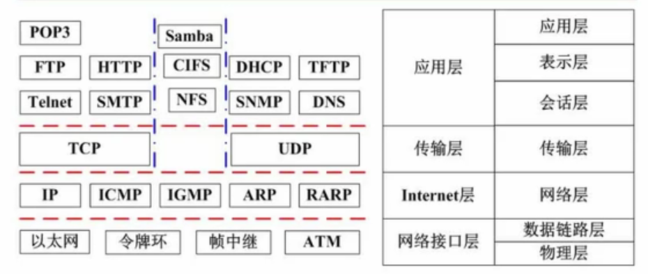

# 04 计算机网络

## 1. OSI/RM七层模型

- **集线器（HUB）：**主要功能是对接收到的信号进行再生整形放大，以扩大网络的传输距离，同时把所有节点集中在以它为中心的节点上。它工作于OSI参考模型第一层，即“物理层”。集线器与网卡、网线等传输介质一样，属于局域网中的基础设备；
- **网桥（Bridge）：**是连接两个局域网的存储转发设备，用它可以完成具有相同或相似体系结构网络系统的连接。

- **交换机（Switch）：**可以说同时是集线器和网桥的升级换代产品，因为交换机具有集线器一样的集中连接功能，同时它又具有网桥的数据交换功能；
- **路由器（Router）：**存放路由表，选择路径。可以隔绝冲突域和广播。

## 2. 网络技术标准与协议

ICMP：控制协议

ARP/RARP：地址解析

TCP：传输控制协议

UDP：用户数据报文协议

DHCP基于UDP，动态主机配置协议，ip地址没有分成功：169.254.x.x 0.0.0.0

DNS服务器：主机向域名服务器递归查询

## 3. 拓扑结构

分布范围：局域网、城域网、广域网、因特网

拓扑结构：星型（办公室网络一般是星型）、环型、总线型

## 4. 网络规划与设计

## 5. IP地址与子网划分

**网络号，子网号**

| 类别    | 十进制                    | 范围   |
| ------- | ------------------------- | ------ |
| A类     | 0.0.0.0-127.255.255.255   | 2^24-2 |
| B类     | 128.0.0.0-191.255.255.255 | 2^23-2 |
| C类     | 192.0.0.0-223.255.255.255 |        |
| D类组播 | 224.0.0.0-239.255.255.255 |        |
| E类保留 | 240.0.0.0-255.255.255.255 |        |

一个A类IP地址由1字节的网络地址和3字节主机地址组成，网络地址的最高位必须是“0”， 地址范围从1.0.0.0 到126.0.0.0。可用的A类网络有126个，每个网络能容纳2的24次方-2个主机。

一个B类IP地址由2字节的网络地址和2字节主机地址组成

子网划分

1. 子网掩码
2. 网络划分子网
3. 多个网络合并

🌰：B类IP地址168.195.0.0划分为27个**子网**，子网掩码是多少？

（后16位）0000 0000 0000 0000

（后16位）1111 1000 0000 0000          |   255.255.248.0

🌰：B类IP地址168.195.0.0划分为若干个子网，每个子网内有700个主机，子网掩码是多少？

（后16位）0000 0000 0000 0000

（后16位）1111 1100 0000 0000          |   255.255.252.0

无分类编址

120.14.21.0/20 表示地址块2^12

🌰：分配给某公司网络的地址块210.115.192.0/20，该网络可以划分为（）个C子网。

C类子网前24位是网络号，后8位是主机号

现在可以使用4个子网，因此是16个

## 6. 特殊IP

| IP                         | 说明                        |
| -------------------------- | --------------------------- |
| 127                        | 回拨地址                    |
| 网络号全0                  | 当前子网中的主机            |
| 全1地址（255.255.255.255） | 本地子网的广播              |
| 主机号全1地址              | 特定子网的广播              |
| 10.0.0.0/8                 | 10.0.0.1~10.255.255.254     |
| 172.16.0.0/12              | 172.16.0.1~172.31.255.254   |
| 192.168.0.0/16             | 192.168.0.1~192.168.255.254 |
|                            |                             |
|                            |                             |

## 7. 无线网

有接入点-无接入点

无线局域网WLAN：

无线城域网WMAN：

无线广域网WWAN：3、4G

无线个人网WPAN：蓝牙、zigbee

## 8. 网络接入技术

有线接入

- 公用电话交换网络（PSDN）
- 数字数据网（DDN）
- 综合业务数字网（ISDN）
- 非对称数字用户线路（ADSL）
- 同轴光纤技术（HFC）

无线接入

- IEEE 802.11（WIFI）
- IEEE 802.15（蓝牙）
- 红外
- WAPI

3、4G

- WCDMA、CDMA、TD-SCDMA
- LTE-Advanced：TDD FDD

## 9. IPV6

1. 地址长度128位（二进制位）
2. 灵活的IP报文头部格式
3. 安全性

单播、任播、组播

