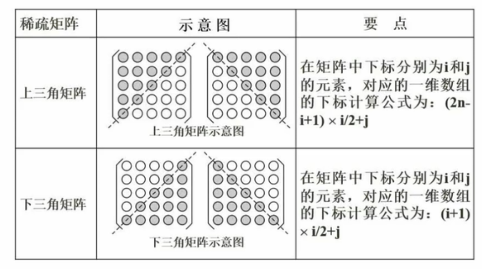
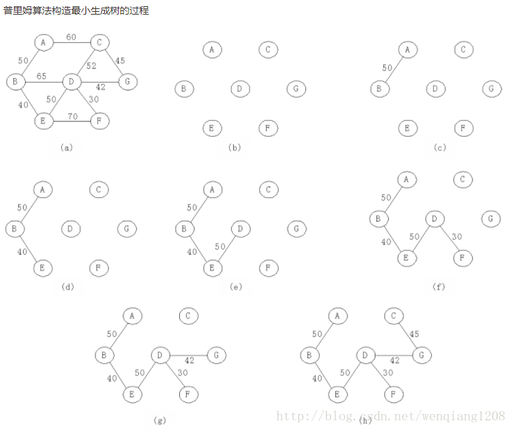

# 06 数据结构01

## 1. 数组

存储地址的计算：

一维数组：a[i]的存储地址为a[0]+i\*len

二维数组（a\[m\]\[n\]）：

- a\[i\]\[j\] 按行存储：a[0]+(i\*n+j)\*len

- a\[i\]\[j\] 按行存储：a[0]+(j\*m+i)\*len

## 2. 稀疏矩阵

## 3. 线性结构

顺序表

链表：单链表、循环链表、双向链表

链表的基本操作：

- 单链表删除节点
- 单链表插入节点
- 双链表删除节点
- 双链表插入节点

## 4. 顺序存储和链式

| 性能类别 | 具体操作 | 顺序存储   | 链式存储           |
| -------- | -------- | ---------- | ------------------ |
| 空间性能 | 存储密度 | 1          | <1（指针占据空间） |
|          | 容量分配 | 事先确定   | 动态改变，更优     |
| 时间性能 | 查找运算 | O(n/2)     | O(n/2)             |
|          | 读取运算 | O(1)       | O([n+1]/2)         |
|          | 插入运算 | O(n/2)     | O(1)               |
|          | 删除运算 | O([n-1]/2) | O(1)               |

## 5. 队列和栈

队列：先进先出。循环队列怎么判断队满呢？尾指针的**下一个**指针是不是头指针。循环队列计算队尾指针需要对长度取余。

栈：先进后出

## 6. 广义表

n元素组成的有限序列

递归的形式进行定义，记作LS=(a0,a1,,,,,an)

LS是表名字，a1是表元素

若LS=(a,(b,c),(d,e))，head操作和tail操作

head(LS)=a，tail(LS)=((b,c),(d,e))

## 7. 树与二叉树

概念总结：

- 节点的度
- 树的度：节点度数最高的那个**度**
- 叶子节点
- 分支节点
- 内部节点：既非叶子，也非根节点
- 父节点
- 子节点
- 兄弟节点
- 层次

满二叉树：二叉树没有缺失的节点

完全二叉树：除了最末层以外，其它各层 (1～h-1) 的结点数都达到最大个数

二叉树特性：

1. 二叉树的第i层上最多有2^(i-1)个节点（i>=1)
2. 深度为k的二叉树最多有2^k-1个节点
3. 一颗二叉树，叶子节点n0，度为2的节点n2，于是**n0=n2+1**

## 8. 树转二叉树

基本原则：

- 孩子节点：左子树节点
- 兄弟节点：右子树节点

🌰：

![img](data:image/png;base64,iVBORw0KGgoAAAANSUhEUgAAAMEAAACSCAYAAAD8WK7FAAAAAXNSR0IArs4c6QAAEO1JREFUeF7tnQlsVEUYx/8o0gKWIgoRCgQpEUsxBY1WDoEYpQWDGqlUA4mJGuoVFFEjGiCCV4iIIXiAIcTYKhBqVBRbTeQQUDRWGjlERQy1oFTQtiCXiPkezHN22d13zTt255uElOzO+Z/vN9f79k2bU6dOnQIHVkBjBdowBBr3PjfdUIAhYEPQXgGGQHsTYAEYArYB7RVgCLQ3ARaAIWAb0F4BhkB7E2ABGAK2Ae0VYAi0NwEWgCFgG9BeAYZAexNgARgCtgHtFWAItDcBFoAhYBvQXgGGQHsTYAEYgoBsYOdOYMoUYMECoH//gArlYmwpwBDYkslbpKoqYNIkoKgIWL6cIfCmpvrUDIF6Tc0cafQvLwfq609/xBD4KLaHrBkCD+KlSipGf4rz2GNASwvw5Zc8E/gkt6dsGQJP8iVPTBC89RZAfzt0AKZOZQh8ktpztgyBZwmtMzhyhCGwVim8GAxBANozBAGI7KEIhsCDeHaTMgR2lQonHkMQgO4MQQAieyiCIfAgnt2kDIFdpcKJxxAEoDtDEIDIHopgCDyIZzcpQ2BXqXDiMQQB6M4QBCCyhyIYAg/i2U3KENhVKpx4DEEAujMEAYjsoQiGwIN4dpMyBHaVCiceQxCO7lxqhBRgCCLUGVyVcBRgCMLRnUuNkAIMQYQ6g6sSjgIMQUC6r1y5EmVlZQGVxsU4UYAhcKKWw7jTp0/HvHnzcOLECSPlTTfdhJtvvtn4e9FFFznMjaP7pQBDoFhZGu3fe+89nDx50sw5OzsbR48eRWVlJT744APj38iRI00g8vLyFNeCs3OiAEPgRK0kcYcMGYKvvvoK//77rxkjJycHDQ0NyM3NNT5r06YNxG25NDO8//77JhCDBw82gejbt6+CGnEWThRgCJyoJcW99NJL8eOPP8ak7tq1K/bv358wRxmC+AgffvihCUV+fr65bCooKHBZO07mRAGGwIFaPXr0wL59+2JS9OnTB7t377bMJRUEcuJPP/3UBIKgEvuIQYMGWZbBEdwpwBBY6Na5c2c0Nzebsc455xwUFRWhrq7OkeJ2IZAzXb9+vQlEVlaWCURxcbGjsjlyagUYgjh9yPBKS0txhBx+zgQyfPrso48+cm1PbiCQC9u8ebOxh6C9BG2y6ZSJ/o0YMcJ1nTjhaQUYAgBz587FjBkzcPz4cdMu2rZti4qKCixcuFCJrXiFQK7Eli1bTCBoDyKOXUePHq2krrploi0Ed955J6qqqmKOMmnJsWDBAkyePFm5HaiEQK7cjh07TCB++uknE4hx48Ypb0OmZqgVBNdddx3WrVsXc5TZsWNHfPPNN+jv86ui/YJANsyff/7ZBIL2LGKGoL/nnXdeptqw53ZlPASFhYXYvn17jFAXXHABDh486Fk8JxkEAYFcn8bGRvM5xJo1a2KAOP/8851UPePjZiQEvXr1wq+//hrTeT179jQeXoUVgoZAbueBAwfMUybaWLP7RqwVZAwEXbp0wZ9//hnTugEDBmDbtm1h2X1MuWFCIFfk0KFDMUCMGjVKe/eNtIVg586duPLKK3H48GGzj+kok3xyPvvss0gYvlyJqEAg10l236AZ4oorrtDSfSOtIFi8eDGmTJmCY8eOmX157rnnYuLEiXjzzTcjZ/hRhyBeMOG+QUD069fPBCLT3TciD8GDDz6IRYsW4Z9//jH7rF27dpgzZw4ef/zxSBt+ukEg11cn941IQnDjjTeipqYm5iizffv2xmfp+oQ0isshuyNIprtvRAYCWo/W19fHGD65If/11192+yrS8dIZAllYct8QbuC0LBUnTek6OFHbQoXgkksuwS+//BJjvN27d8fevXsjbdBuKpcpEMhtJ/cNAURTU5MJxA033OBGotDSBA5Bt27dQILJgXzz6bQnk0MmQiD3l+y+sWvXLgMI+pcO7hu+Q0BuyPTwqrW1NeYo8+qrr8YXX3yRyXYfyecEQQguu298++23JhBRdd/wBYJ3333XOLYkl18R6CjzlltuAb11QceQ6TNBsj4V7hu0bCK/LTFDEBBRcd/wBQJ6aEW/pyWnrWnTpuH555/X0e5j2kz+SvFPtHUT5Y8//jAd/OggZNasWZGQwBcI6McndMzJgRVIpgC5b2T0TMBdzwqkkwK+zATpJADXlRVgCNgGtFeAIdDeBFgAhoBtQHsFlEHQ2NqIoUuGYk/zHlPUYb2GYfXE1eiU1UlLoTduBIYPj216ZSUwcaKWcpzV6KoqYNIkoKQEoP9feGE4uiiBoHpHNcpWJH7teG52Lmon1aI4T68XRokOTtSts2cDM2aE0+FRKfXAgdODQW1tBkDQcqwFY6vGYmvT1hhjl2cGHWcEgoCCPOrLM8OGDcCwYVExyeDrIQ8SaT8TEARLtyzFQ8UPnaWkAIG+2HT3JuTl8CvI58wBZs4EdF4Wka9keTlwzTWAcCJO++VQsnGEIThbGTEC6gwBDQTV1cArrwD0fwoMQfCzcWglCgNYvhzw+X1fobUxVcFiSUiDQGnp/8vFjIVg9rrZmLV2FsoLy7GsbFkkOyXISomlkK4bY7EZFiO/vGfKSAjEiVHv3N7a7gcSnRDpvCEWg4DQIB6KtD4ijR9NxQyg6/Go0CPZMamOIAgt5FkwIyHQ/VjUamklTkXq6/U6HZJPg+bPB9q3P61UxkGwuXEzSipL0Hy0GSsnrMT4gvFWNqHl98IgLr443BORoMQXhv7bb0D8YUBGQSAAyM3K1Xb9b9eootLxduvrNV6qJ+eJ8g5jqejZbUI8MW5oaWAAbFiMbjOBFhCIWaA0v5SPQc9AQIY+ZQqwYEHsswB5T6DrMak8TkRlVvQ8E6RynpMbrNOzAtnYE00OFRWAvEG0MYFkZJSMgUAch1r1kk4QyCcf5CUphzDWvFZ9E9b3GQNBWAJyuayAKgU8L4dUVYTzYQXCUoAhCEt5LjcyCjAEkekKrkhYCjAEYSnP5UZGAYYggK7o0KEDjhw5gh49eoBeUKt7qKqqwj333AN6cfOYMWNCl4Mh8LkLxMuJRTFZWVkxb+v2ufhIZk/vIKUXNnfq1An79u0LvY4MgU9dMH36dLzwwgtG7rW1tSgpKcHbb79tvLKeAl02TjODboHa/8477xjXctF1XLfeeiuWLl0aqgwMgQ/y06UkZOR0J4O4dVO+n4BeWU+fV1RU4PXXX/ehBtHNkjShJRBdF/vaa6/hgQcewPfffw+6rSiswBAoVl4YeOfOnWPuI4i/pIPuK6BLCS+77DLQVUc6hMLCQtAtNrQ/EqG4uNjQIczruhgChdZHhk6BbmOhm1nkkOimmsGDB4Muv8vJyUFLS4vCmkQvK7oXefTo0Zg3bx4eeeQRs4K0LKLreR999FE8++yzoVScIVAgOxn9qlWrjJxow5coJLuu6cknnzRu8pGXTgqqFLksaGbs2LFjwtOxp556Ci+++CLoStgwAkPgUXWxrGnbti1OnDiRNDerO8sIAhoV58+fj4cffthjraKV/P777zfW/3RdFcGQKPTv39/4ju5JDjowBB4UJ8M/efKkcTvnnj3/v4jYyUwgxxXPE4YPH47PP//cQ82ilZR0ojatXbs2acVoTzBgwAAsXLgQ9913X6ANYAhcyE1HnqX05igATzzxhK2LCa1mAlENccF5165dsX//fhe1i1aSq666CvX19Th+/Lhlxe666y5UV1eDrv0NMjAEDtUeNGiQ0alk1LR8sRvsQkD5lZeXY8WKFcbtn3aMx24dgo63detWXH755aA1/zPPPGOr+O7du4NutqTLH4MKDIEDpcVyhU4z/v77bwcpYUCTbNOcKKMNGzZgxIgRxlfr1683lhPpFmg2o9DU1GS76h9//DHGjh1rQEB/gwgMgU2VhfsDzQR0S7vT4BQCkT+5WdBsMGHCBCynd5akSaDR/7nnnsN3332HgQMHOqo1Xf9bV1cXmEsFQ2DRPfHuD3TW7Sa4hYDK6tatmzGa9unTB7t373ZTfOBp2rVrh6KiInz99deuyg7SpYIhSNFFidwfXPUonC+H4su59tprQUskN0sxt3V2m27kyJHYuHGj6TLiJh9yJyGXiu3bt4OOT/0MDEESdZO5P7jtDC8zgSjz5ZdfxtSpU0FLMzqajWKgZwFdunQxjjlfffVVT1UMyqWCIUjQTancH9z2qgoIRNni+QQt1WjdHaWQl5eHw4cPG/5AKgLtiaZNm+ZrOxkCqafsuD+47ViVEFAdyBe/tbUVbjfqbtuRKt1LL71kGCz5CV1//fVKihAuFeR0RzOgH4EhOKOqXfcHt52gGgKqR0FBgeGGHO+x6raOXtPRfqVv377Ytm2b16xi0vvtUsEQABDLi549e6KhoUFpB4rM/ICA8r733nuxaNEiow2pfJd8aZSUKR1r1tTU+LJX+eGHHwzg/XKp0BqCTz75xPjFFwW77g9ujckvCKg+e/fuBQFMgX6/e8cdd7itput0tFShcql8P4KfLhXaQiB8+Z26P7jtYD8hEHXKzs423JHpWQb5NwUV8vPz8fvvv+PQoUO+FumXS4W2EJDrMp08OHV/cNvLdOQaxHKFTmcOHjwY8+stt3W2m44e4tEPYsTvp+2mcxqPXCrmzp2LNWvWOE2aMr62EChVkTNLawUYgrTuPq68CgUYAhUqch5prQBDkNbdx5VXoQBDoEJFziOtFWAI0rr7uPIqFNAGAvme5UTC+Xn3cvy9bsN6DcPqiavRKauTpz4UN4dubNhomY/q67ISla26DNEov8tiCM4o7QcEqYxUhcE4geDpUU9j5siZlrDYidDY2oihS4ZiT/PZb9jondtb6VW+qQYvVYOJNhCI0ViF8dkxFIpz+8rbsXzbcuRm56J2Ui2K84qNpNSxS+qWYPG4xXazchVPGCsl3nT3JuTl5LnKJz6RaJds8DKQqjSWYZPzlMtSAbd2EKgQzY4lCehUj4x2yhZxxM2iKmc5YZjNx5pjwKYyVUOXauBSWRZD4MSqbMaVRyqVBmizeHO2KakswcCuA5XsP0TZqYxPtJviqtjzCIiTDVw0I9XsqjkLRic6UVxtIPBjVEwmtljH5mblKl2GOOlcsWTxA8JkxicAGdJzCJaVLXNS3YRxRRuSQaCqT7WDIF5tP5ZHYhoXG7fJqyYbewMR/ChTbpeAUPUsIMoQI35DS4MJuepZgMoSRp5oj6FyX6ANBGJUSTTkqF63i84b028MqLMSHWGq2jwmao+fs4AoL9GpTfwBgNepQC4jXi+5P70OKtpAkKhDhLHSdyqNUs43/hhPfmbgx1LF71lAHqGTGblXo5TzlbWUP6eBqyS/BG/UvQGvOmoNAYnqxymO6LhkM0yqad7r6Gm1mfSavzw6xxu7KNvPGYHqL3SlY+ZZa2cxBF47VeVRm6iL1TMJq+/dtinV8aXbPOPTWUHmJ+ByXcSeYGvTVj4d8tq5fkBgtSTxCwK/8pU1ttpvBFEHqo+Vxk7sgpdDO6pRtqIMqh7Bk/hWI7LV0Z+TDkxkoCrX5FGdCVRqqDUE8qbL6+YqmbHE7wus9gtuAbACz22+8emC3hOQsd9WeBvGF4w3qiIfjaoauLSAIJXDl+qTIWE0Vs5tqqFTuTywAibZiY1Ip3ImSna0rfJYW2sIVJ9iJDKeeINR2XlyeUGtxUWZiQYWP9qWaDBRCRm1RwsIrEY2/l5vBRgCvfufW88zAdsAK8DLIbYBVoD3BGwDrADvCdgGtFeAIdDeBFgAhoBtQHsFGALtTYAFYAjYBrRXgCHQ3gRYAIaAbUB7BRgC7U2ABWAI2Aa0V+A/e4mv4fIlNGIAAAAASUVORK5CYII=)

1的左子树是2，2的右子树3，3的右子树4

3的左子树5，5的右子树6，6的右子树7

4的左子树8，8的右子树9

![img](data:image/png;base64,iVBORw0KGgoAAAANSUhEUgAAAKAAAAEoCAYAAADfW/osAAAAAXNSR0IArs4c6QAAGQRJREFUeF7tnQuUT9Uex396YDwiU8S4d4kobiukhwyVVGMRKjJhYlGeYfUiRXS7VMTKopBXKwnj0VIeyyiUx+R6j+5N8pp1M5JCYxiPirt+e9rj+Ps/zjl7n7P3Pue312q5N2c/zvf3+f/243favxIXLly4AFRIAUUKlCAAFSlP3TIFCEACQakCBKBS+alzApAYUKoAAahUfuqcACQGlCpAACqVnzonAIkBpQoQgErlp84JQGJAqQIEoFL5qXMCkBhQqgABqFR+6pwAJAaUKkAAKpWfOicAFTKwezfAwIEAEyYA3HyzwoEo7JoAVCT+J58AZGQA1K8PkJlJACoyQ/i6Ra+Xng6Qk1P07gQgfZLv26+Aez3scNAggBMnADZuJA9I/02ITwgigB9/DIB/likD8PzzBCCtAX2CL7Kb06cJQNSEACQAFSlQ1C0BqEh+8oAEoCL0irolAAlAAlCpAgSgUvnJAxKABKBSBQhApfKTByQACUClChCASuUnD0gAEoBKFSAANZCfhkCREGJAqQIEoFL5qXMCkBhQqgABqFD+devWQbNmzRSOQH3XBKACG8yZMwdGjRoFhYWF0LJlS+jbty/cdtttCkaivksC0EcbDBs2DKZNmwZHjx6F++67D15//XVYvXo1TJkyBRo3bsxAfPjhh30ckfquCECPbXDu3Dno1q0bfPbZZ3DllVdCeno6TJ8+/bJeP/jgAwZiUlIS9OnTB7p27erxyPRongD0yA7Z2dkwaNAg+OabbyAlJQUGDBgAgwcPTtgbgoog7t69m4GIXrF8+fIJ65n6AAEo2XIIz9ixY2Hfvn3QsGFDGDlyJLRq1cpxLxs3bmQgzp8/n0GIMNauXdtxO7pXIAAlWei5556DWbNmwcmTJ9nGYurUqXDDDTcIt56bm8tAxH9at27NYGzatKlwu7o0QAAKWOLw4cPQq1cvyMrKgrJly7J12/jx4wVajF31zJkzDMLJkydD9erVGYgdOnTwpC8/GyUAXai9fPlywB3t9u3boWbNmmyth1OkX2Xu3LkMRtxN83UibnBMLASgA6uNGTMGJk6cCHl5eezYBNd6TZo0cdCC3EfXrFnDQFy1alUxiLjhMakQgDas9cwzz0BmZib8+eef0LZtW7bWK1mypI2a/jyya9eu4ukZlwE4PTdq1MifzgV7IQBjCPjdd9/BwIED4auvvoLk5GTo2bMn29HqXI4dO1a8Yalfvz7zirhx0bkQgBHW4WEyBLBu3bpsrde5c2edbRh1bDNnzmQbFizoEXv06KHlOxCAf5klMkyGa7169eppaTQng8INE4KYk5PDPCL+U6lSJSdNePpsqAG0Gybz1AI+Nb5161Y2PX/00UfFGxb08KpLKAF0GyZTbSwZ/eMOnp8ntmjRgsHYvHlzGU27aiNUAKLw77zzDuzfv18oTOZKac0q4Y4ep2bUBDdZCGKnTp18H2UoAPQqTOa7tTzqcOHChQzGgwcPFk/PpUuX9qi3S5sNLIA8TLZixQooV66cp2EyXyzlQyfr169nIC5btqx4w1KjRg1Pew4cgKrDZJ5ay6fG9+zZU7xO7NixI4MRIz9elMAAaA2T3XPPPWytpzJM5oWx/G6zoKCgGMQ6deqw88R27dpJHYbxAOoeJpNqLYWNYfgRNyynT59mHrF3795SRmMkgCaGyaRYS4NGVq5cydaJ+MEs/xKncuXKrkdmJIB4bnXkyBEYOnSokWEy19bSqOLOnTsZiPjR7YgRI1yPzEgA0QMGIUzm2moaVURHEDoPqJH+NBRBBYz0gILvTNU1UoAA1MgYYRwKARhGq2v0zgSgRsYI41CMAfDoUYAuXQCysi6aCc9C330XICkpjKYLxjsbAeCGDQCx/lvssCd8Nh1D7QGMdZu81SOSJzQXQyMAXLkSIFoMnEOI8mMS6ORkcw0R1pFrD2A8wxCA5mNLAJpvQ6PfwGgAcdrNyAB44w2A114z2g6hHbyxAPKdcVoarf9MptdIALnnoyMYk9ErGrtRANLRi/nARb6BMQDu3g2Qng6QkwOwfj1AamrwjBHGNzICQA4f3nhL533BwlR7AHkkJDeX4AsWeoasAbn3a9+ejloIQAUKxPsQwTocOgtUYBwJXWo/BfMjl0TvSgAmUkjPv9ceQD1lo1HJUoAAlKUkteNKAQLQlWxUSZYCBKAsJakdVwoQgK5ko0qyFDAOwCuuuAIuXLgAmAdjx44dsnSgdhQpYAyAjz76KEv6jAWvj/3jjz/gqquugo8//jgQSfsU2V95t0YAyL0eqoXej5datWqxC8ebNWsGa9euVS4mDcC5AtoDWKJECfZWCCHe7B5ZMAv5uHHjoEyZMiytlik50pybKpg1tAUQgcLbOLG89NJL7MrdeKVatWrw008/QZs2beDzzz8PprUC+FZaAsinXPR+58+fty179+7dWSaga6+9lk3NFSpUsF2XHlSjgFYA3nXXXbB582amRJUqVQBTLTgt+fn5LIn08ePHoVu3bvDhhx86bYKe91EBbQCMtdFwqwVOxUuXLgWcmjE9FRU9FdACQL7RwLTzeLwiq2zZsoXlQSssLGTryNGjR8tqmtqRpIBSAEuVKgWYsRLLggULPDvPw2MazAKExzZ79+6VJB01I0MBZQC63Wi4fWnMh5aRkcGOcnBHjfnjqKhXwHcAb7rpJti3bx97cxUeCUN4mGKAQnnq4cMR+Aqg314vlsTjx4+HQYMGAa45Z8+e7dnUr4eJ9R6FLwDi9PfEE08wJUqWLAlnz57VQhUK5ak3g+cA4gcDPIRmjeOqf/WiEVAoT60lPAWQH684jWiokIRCeSpU92gNiPnDfv75Z/ZGd955J2zatEnN2znslUJ5DgWT8Lh0D6jLRsOtNhTKc6ucu3rSAMRd5dixY9kokpKSWPTB5NK2bVtYsmQJVK1aFQ4dOmTyq2g9dikA4nEG/2pFx42GWwtYQ3kvvvgiYFZ2KnIVEAbQpI2GW+nuvfdeWLduHfvKhh+iu22L6l2qgGsAK1asCLhewtKuXTtYvHhxoLXFs8ynnnqKfSxBoTx5pnYNIHo+E45X5ElV1FKDBg3YD+/AgQOymw5le64BDKVa9NLSFSAApUtKDTpRgAB0ohY9K10BAlC6pNSgEwUIQCdq0bPSFSAApUtKDTpRgAC0qVa0u6pnzy7K4k7FvQIEoA3t4t1TTXdT2xAwziMEoA39EEAsVm9n9YiUucmGiDEeIQDdawf/+hfA8OEANBW7F5EAdK8dSxuG+YoJQPciEoDutWMecNEigMxMgJtvFmgoxFUJQJfG59MvbUJcCvhXNQLQpn7RdsK0+bApHu2CxYWKdRRDEIppSx7QpX7WBNq0CXEpot9Xc7gfpp41KZG2uF3IAwpoePToxcNpyuTuTkgC0J1urBZ5QAHxaBdsTzyEbOBAgAkTLj3rs64B6SjGnpbRniIPmEA7K2jRHu3dG+Ddd/E/xndvhDDXJABtWJ+v9bKyLn2YjmBsiJfgEQJQXENqQUABAlBAPKoqrgABKK4htSCgAAEoIB5VFVeAABTXkFoQUIAAdCgev4AzOTkZfv31V4e16fFIBQhAm0yUK1cOTp06xZ6uUaMG/Pjjj+zy9QceeABWrVplsxV6jAB0yECvXr1g2rRprFZkionbb78dtm/fDldffTXLN9KxY0eHrdPj5AHjMGC9+RWvHMarhyML3hdYqVIlKCgogJSUFDh48CBR5UABAjCKWJUrV4ZffvmF/Q2mFtuzZ09CSfv37w+TJ08GvKK4Q4cOMH/+/IR16AGP0jSYKiwmt+7RowcbPibY+f333x2/Sp06dRiw6C2zs7PZhZZUYitAHvAvbXAdx3MVz5gxoxhEN/DgujA1NRVOnz4NtWvXhh9++MFNM6GoE3oAERCeQ/i6664rnnplWB/z4y1atIhdZdyvXz+YOHGijGYD1UZoAUTvVKZMGWZMPNvj+ey8sG716tUhLy8PypcvD8eOHWPTO5UiBUIJYOnSpYszdj799NMwffp0z3mYN28edO3ala0rGzZsCNu2bfO8TxM6CBWAPN8HGqZs2bJw8uRJ322EB9dr1qxhuYpHjRoFL7/8su9j0KnD0ACoWw47XG8ePXoUwh7SCzyA1hBas2bNYO3atdo4gNGjR8PQoUPZ+rN58+awevVqbcbm10ACCyCu7WbOnMl0LFWqFJw5c8YvTR33Yw3pzZo1C5588knHbZhaIZAA2gmh6WawsIb0AgXg9ddfX/yJlN0Qmm4gDhgwACZNmsRCeu3bt4cFCxboNkSp4wkEgDjV4pSLxW0ITaqqEhqzhvQ2bNjAjm6CWIwH0BpCQxC7d+8eGDvt2LEDmjRpEuiQnrEAWkNoOPUeOXIkMOBFvgh+Z4jpYjGk17dvX3jvvfcC867GAehnCE03KwcxpGcUgHiccu7cOcZFz549YerUqbox4vl48DvDjIyMwIT0jAAQD5DX4z0YCkNonpPlsIMWLVqwg2s8cho5ciQMGTLEYQt6PG4EgGHNzm4HEQzpYSTl+PHjdh7X7hkjANRONRqQNAUIQGlSUkNuFCAA3ahGdaQpQABKk5IacqMAAehGNaojTQECUJqU1JAbBbQEMNG9zHQ17uWm5pmc0tKAZfFMTnaDg/91CED/NZfeo/UOawJQgrw8GzmlP7AnpjWPHQFoT7O4T3EAKQdbYjH5cqVxY4Dc3KLnaQpOrBsBKKgRr86TZr//PrAE2gSgBGH5lEKbjfhiWmeKli3NzFun5SYkVm5empIvAhmZKBH/pksX8oAS/F/RVDJ8ePSmTFtkSxEkSiNcIz5LmJq5U0sPGM1oVq8Y9t0x18KqAwHo1U/d0i5f84TZC1p3vdYkiQSgDwCaKrIsafj7Hz4MkJl5afpYU7UxZgpGI5oqsiwAY23OYrVvwimCUQDyKTisOXoJQFk/ZRftWMU34Zft4hWFqpg6O2jnAWMlh+bWCfsOOBalBKDQ7/fyA9bI7OT161++8JbUZSCaIQADYUZ6Cb8V0G4K9lsA6k+tAgSgWv1D3zsBGHoE1ApAAKrVP/S9aw8g3gyKFzXeeuut8O2334beYJECtGzZElauXAnp6ekwd+5c4/TRHkC8mIgXvDeZyqUK8IubUBsT9dEawAoVKsCJEydgwoQJMHDgQMAUW3hBJZUiBXg2AAQPE/Hg/3eTYlalnloDaL2WrWTJkkxcE3/lXhiYJ9Vet24dNG3aFLZu3Qp33HEH1KhRAw4cOOBFl560qS2AeNs93ntnBY7uCSxi4NVXX4W33noLbrnlFti1a1cxGHfffTds2rQJMAPT4MGDPQFGdqPaAhgNNn4xeefOneET/DohpAW1wewA/LpiqwyYghazQp0/f94IdbQEkCcWjDbd8k1JWKdiO0sR1A/Xy4WFhdpDqCWACBkuqDF9VWThax1M/owblDCVunXrwvfffw+vvPIKvPnmmzFffcyYMSwNLE7JGzdu1Foi7QCM5/24ktHWh1qrLGFweEk7XtZuNyfKjTfeCLm5ubBlyxZo1KiRhBF404RWAGICFsyVds0110B+fn7cNw7bhgR/mPjOuDGzW3CdiGtBJ3Xsti3rOa0AdLK+q1KlCsuO9Pbbbwc+6zjPeexm3YuaVqpUiSXH1rFoA2CDBg0gJycH6tevz0JvdooTYO20p+MzGGrLysqCtLQ0WLFiheMhdurUCebNm8dyEOsYqtMGQDcw4XkXJmixuy5ybD0NKqAuZcuWhZMnT7oeTXJyMhw7dkzLQ3wtAOQht4kTJ0L//v0dCW1n0+KoQY0expMAnHZlnOlhW6iVbqE6LQAU3VDEO7bRiCdHQ4kMtTmqHOVhXUN1ygGUcaSCu+aCggLYvHkzi4eaXmKF2kTfS8dQnXIARb0fN4qbNaSoQb2qHy/UJtqnbqE6pQDKXL916dIF5syZA7Vq1YK9e/eK2klZfTuhNtHB6RSqUwqg7LWbTKBFjeymfr169djXLbizx69dvCr89ECHUJ0yAL2CxcvpyysgsF2noTbRsegSqlMCIB634BfOdkJuToVOSkpinyO5iRo47Uvm825CbaL96xCqUwKg1xsGWRsbUQPbrS8SarPbR6znVIfqfAfw66+/hvvvvx8w9LZ9+3ZR/aLWT01NhezsbGO8IHqiFi1auAq1iQqIobrFixcr+29tfAdQVDCqHywFCMBg2dO4tyEAjTNZsAZMAAbLnsa9DQFonMmCNWACMFj2NO5tAgkgv02fW0PHW/XxhpHnnwf44IOLzITx/utAARjNqNy8Ohk33kXsYcsCFSgAeQK/yAvNMb3V8uVFHkeHwsdphc3649Hpx+K1XoEB0JQ8ckFMtyUCaSAAtHoP3ZPYxEunwN8DDWpNRChiYN3rBgJAnkHyhhsA8M6i5GS9ZccpeNGi2AkHU1MBXntN73eQNbpAABiZQ27s2EsTXuuWaZ17utzciz+YMHo/hDgQAPI8coMGAeB9RdajDR13wTgm7rVzci76kjBmgwoUgGjKyDM/65mgLuvDRFkvdfPYsqbbaO0ECsBYZ2jRUtx7KWq8tq2eLxI0Ps4wecJAAMi9XKzzs0R/7yeMHLJYXk6nH4sfugQCQO5VGjeOfnyhE4D8EDrWckCnsRKANhWId7iLTXCj67C2Ig94qVED4QHxlbhhI9eBsf69TbalP0ZrwIACGO9DBHxlXXbA1h9LLLp18NTSf3kxGgyMB+TvF3nEoevXJdG+iNF1rF7CGDgAvRSL2pavAAEoX1Nq0YECBKADsehR+QoQgPI1pRYdKEAAOhCLHpWvQCABxFQPO3fuhKpVq8KhQ4fkqyaxRX5tLmY8x3QKYSuBBNCkLOt8rPinjNvwTQM4cABiPg1MZIjZIvGewFatWsGyZcu0tEvfvn1hypQpUL16dTh48CAbb6lSpbQcq1eDChyA1ptXvb6HUNQo1vHh/8b7oc+ePSvarFH1AwcgGhK9CHqTNm3awNKlS6F169bsT51Kv379YPLkyYB/vv/++1CzZk04cOCAMXcaytIyUABiNiBcR1mv59XVC0YbF/47L64tlgWLF+0ECkA0IE7B1vSkOnrBSO/HDctTlpl2v7UImIEBEDcduH6KZjzdvGC88eDf4Q32+/fvF7GrMXUDA2C8i8kfeeQRthPWYS3IvR/ugCdNmnQZKLh+PXfuXGjWgoEAMCUlhR04//bbb4DTWLSiixdMNI7CwkKWnvXBBx+EL774whhP5naggQAwkVFRHB28YCLvx43oVRIft5B4Wc94ANu3bw+ffvopPP7447AI77uIU+yA6qnYJUqw5hNtMkaNGgXDhg2DkSNHwtChQ70ckvK2jQfQCVQqvaBd78eJMC3ZjluSjQYwPz8fKlasCNWqVYO8vDxbGjgB1laDNh9y2u9DDz0EX375JZw6dQowxWpQi9EAulkrcS+Ify5ZssQXuz777LNsxxtr5xtrEGEIzxkNoDXs5oQkp97ISdsyd+BhCM8ZC2C0sJtdUPz0gm69n3UtGOTwnLEARgu72QUQn/PLC4r2E/TwnJEAxgu72YUQoyLLly9n54NerQW59+vTpw/78sVtCXJ4zkgAZR1RiHqnREDJaj/I4TnjAORht4KCAsBEzyLFSy8oy/vh++FHFuj1gxieMw5AWV7Fusi3E51wCrrscbo5cnI6ZhXPGwVgx44dYeHChfDYY48lDLvZFZN7wXHjxsELL7xgt1rc5+bOnQudO3cG0bWftRMMzw0fPhzwzyFDhkgZpw6NGAWgDoLRGOQqQADK1ZNac6gAAehQMHpcrgIEoFw9qTWHChCADgWjx+UqQADK1ZNac6hAqAA8cfYEtPqkFWz4cUNCmdL/kQ7zOqi/LCjamHUZW0IRbTxAAMYQ6Z/3/xOG3zfchoTePfLvvH9D2uw0yD+Tf1knqX9LheVdlsM1pa7xbgA+tBwqABPpmVeQB01mNGGPZT+dDSnlUxJV8ezv+Vj+l/8/sHo8q0fU4UciKgABaFHwja/fgBFfjYCFHRdC+7rtRbUVqr9o1yLoML/DJfDxBnX6oQi9ZFDStYqKgPX5dHfr9bdqMbXxH0MsL/fkwidhxb4VkJWRBXen3C1DAiVtkAf8S3Y0aOZ/M7XwfjgkPp5YAOrkrUXIJQA19H5oUA5YtB1vkNaBBKDF2+iw9uPexLoDjoSQe0d81vSNSOgB1G3tZ53OuBeMnOL+XuHvkFYrDaZtm6bNksHtNBx6ABMt9t0KK6te5FkgwodHRDO2zdBmxy7yrqEGkB9n5J/NN2o3ydeA//nlP0aNOxqooQYw3lmbyK/a67o6LxucvnuoAUx01OFUTL+eN3Xc5AEtCpgw/SJoT/zjieKojPX4hWLBfv3cPerHhGnMetxilYFvRFTGqmWZJbRTsAnrv2ifYpl+7hcJbmgBlPULpnbEFCAAxfSj2oIKEICCAlJ1MQUIQDH9qLagAgSgoIBUXUwBAlBMP6otqAABKCggVRdTgAAU049qCypAAAoKSNXFFCAAxfSj2oIKEICCAlJ1MQUIQDH9qLagAgSgoIBUXUwBAlBMP6otqMD/ARhHUWqSWd17AAAAAElFTkSuQmCC)

## 9. 二叉查找树（Binary Search Tree）

左子树 < 根节点 < 右子树

插入：通过比较插入

删除：

- 若是叶子节点，直接删除
- 若待删除的节点只有一个子节点，则将**子节点和待删除的父节点**连起来
- 若待删除的节点有两个子节点，则在左子树上，找出**最大值s替换待删除的节点**，然后删除s，此时s属于上述1、2的情况之一

## 10. 最优二叉树

- 树的路径长度
- 权重：叶子节点的值
- 带权路径：路长*权值
- 树的带权路径长度：带权路径之和

🌰 如何构造哈夫曼树：5，29，7，8，14，23，3，11

(1) 将w1、w2、…，wn看成是有n 棵树的森林(每棵树仅有一个结点)；

(2) 在森林中选出两个根结点的权值最小的树合并，作为一棵新树的左、右子树，且新树的根结点权值为其左、右子树根结点权值之和；

(3)从森林中删除选取的两棵树，并将新树加入森林；

(4)重复(2)、(3)步，直到森林中只剩一棵树为止，该树即为所求得的哈夫曼树。

## 11. 线索二叉树

为叶子节点分配next

前序线索二叉树，中序线索二叉树，后序线索二叉树

## 12. 平衡二叉树

任意节点的左右子树**深度**相差不超过1

每节点的平衡度只能为-1，0，1

## 13. 图

无向图

有向图

图的存储：

- 邻接矩阵
- 邻接表

图的遍历：

- 深度：优先访问下一个节点
- 广度：优先访问访问相邻节点

拓扑排序：

有向边表示活动之间开始的先后关系

## 14. 图的最小生成树

生成树是将图中所有顶点以最少的边连通的子图。
权值和最小的生成树就是最小生成树。

从最小生成树的定义可知，构造有n个结点的无向连通带权图的最小生成树,必须满足以下三条：
（1）构造的最小生成树必须包括n个结点；
（2）构造的最小生成树中有且只有n-1条边；
（3）构造的最小生成树中不存在回路。

prim算法

(1)输入：一个加权连通图，其中顶点集合为V，边集合为E；

(2)初始化：Vnew = {x}，其中x为集合V中的任一节点（起始点），Enew = {}；

(3)重复下列操作，直到Vnew = V：
在集合E中选取权值最小的边（u, v），其中u为集合Vnew中的元素，而v则不是（如果存在有多条满足前述条件即具有相同权值的边，则可任意选取其中之一）；
将v加入集合Vnew中，将（u, v）加入集合Enew中；

(4)输出：使用集合Vnew和Enew来描述所得到的最小生成树。

