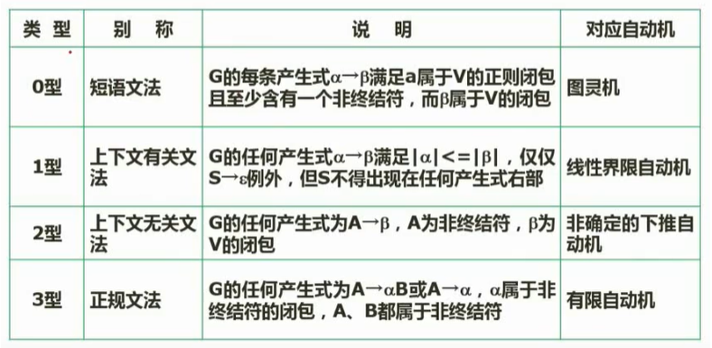
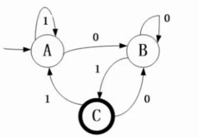

# 08 编译原理

## 8.1 基本概念

机器语言和汇编语言为低级语言，即是面向机器的语言。

高级程序设计语言需要翻译，翻译的基本形式有：汇编、解释和编译

编译与解释：

- 解释：直接解释执行源程序，或翻译为某种中间代码再执行
- 编译：源程序翻译目标语言程序
- 在解释模式下，不生成独立的目标程序

语法、语义和语用：

- 语法： 语法是指由程序语言的基本符号组成程序中的各个语法成分（包括程序）的一组规则，其中由基本符号构成的符号（单词）书写规则称为词法规则，由符号（单词）构成语法成分的规则称为语法规则
- 语义：语义是程序语言中按语法规则构成的各个语法成分的含义，可分为静态语义和动态语义。静态语义指编译时可以确定的语法成分的含义：而运行时刻才能确定的含义是动态语义。一个程序的执行效果说明了该程序的语义，它取决于构成程序的各个组成部分的语义。
- 语用：表示了构成语言的各个记号和使用者的关系,涉及符号的来源,使用和影响.

文法

正规式

有限自动机

传值与传址

多种程序语言特点

- 

## 1. 编译过程

- 解释

- 编译

源程序->词法分析->语义分析->中间代码->代码优化->目标代码->目标程序

- 词法分析：正规式、有限自动机
- 语法分析：根据语言语法规则
- 语义分析：语义检查
- 目标代码：中间代码转为低级语言代码，需要考虑硬件系统结构

> 词法错误：非法字符、关键字或者标识符拼写错误
>
> 语法错误：语法结构出错、if endif不匹配、缺分号
>
> 语义错误：死循环、0除数、其它逻辑错误

## 2. 文法的定义和语义推导树

一个形式文法是一个有序四元组G=(V,T,S,P)，其中：

1. V：非终结符。可理解为占位符
2. T：终结符。是语言的组成部分，是最终结果，
3. S：起始符。是语言的开始符号
4. P：产生式。用终结符替代非终结符的规则，形如$\alpha \rarr \beta$

文法的类型：



🌰：

文法G=({a,b},{S,A},S,P)，其中：
$$
\begin{align*}
& S\rarr aAS\mid a\\
& A\rarr SbA\mid SS\mid ba
\end{align*}
$$
请构造句型aabAa的推导树，`S→aAS; S→a; A→SbA; A→SS; A→ba`

``` 
		S						  S							S
        |						  |							|
------------------		 ------------------			------------------
|       |        |		 |        |       |         |       |        |
a       A        S       a        A       S         a       A        S
                                  |       |                 |        |
                              ---------   a              -------     a
                              |   |   |                  |  |  |
                              S   b   A                  S  b  A
                                                         a
```


## 3. 有限自动机和正规式

$M=(S,\Sigma,\delta,S0,Z)$

1. S是一个有限集，每个元素为一个状态
2. $\Sigma$是一个有穷字母表，每个元素为一个输入字符
3. $\delta$是转换函数：是一个单值对照
4. S0，属于S，是其唯一的初态
5. Z是一个终态集

有限自动状态机可以用状态转化图表示，假设有：DFA=({S,A,B,C,F},{1,0},δ,S,{f})


正规式是有限状态机的另一种表现形式


🌰

下面文法G[S]无法识别（D），对应的正规式（C（代入法））

S->aA|bB

A->bS|b

B->aS|a

- A. ababab B. bababa C.abbaab D. babba
- A. (a|b)\*    B. (ab)\*     C. (ab|ba)\* D. (ab)\*(ba)\*

正规式要能表示出所有的情况来


下图是一个有限自动机，A是初态，C是终态，该自动机可以识别（C）

> 从A开始经过四个状态到达C



- A. 0000 B. 1111 C. 0101 D. 1010


## 4. 表达式

```
  +
 / \
a   b
```

前缀表达式：（+ab）

中缀表达式：（a+b）

后缀表达式：（ab+）

🌰：表达式(a-b)*(c+5)的后缀表达式：ab-c5+\*

```
		*
	   / \
	  -   +
	 / \ / \
	a  b c  5
```


## 5. 函数调用的传值和传址

| 方式 | 特点                                   |
| ---- | -------------------------------------- |
| 传值 | 形参取的是值，不会导致实参的值发生改变 |
| 传址 | 形参取的是地址，相当于实参的地址引用   |

```c
// 传值
void swap(int x, int y){
    int t;
    t=x; x=y; y=t;
    printf("%d %d",x,y);
}

int main(){
    int a = 3, b = 4;
    swap(a,b);
    printf("%d %d",a,b);
}
// 4,3  3,4
```

```c
// 传址
void swap(int *x, int *y){
    int *t;
    *t=*x; *x=*y; *y=*t;
    printf("%d %d",*x,*y);
}

int main(){
    int a = 3, b = 4;
    swap(&a,&b);
    printf("%d %d",a,b);
}
// 4,3  4,3 
```


## 6. 各种程序语言特点

- Fortran 科学计算
- Pascal   为教学开发
- C  高效
- LISP 函数式程序语言，人工智能
- C++ 高效
- Java 跨平台
- C#  中间代码
- Prolog  逻辑推理

