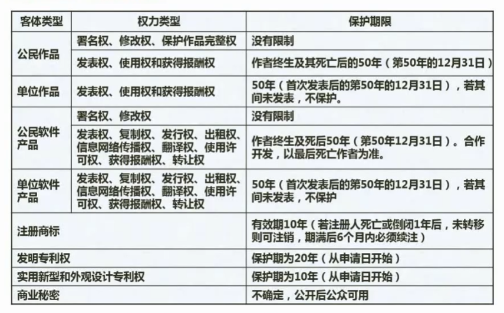
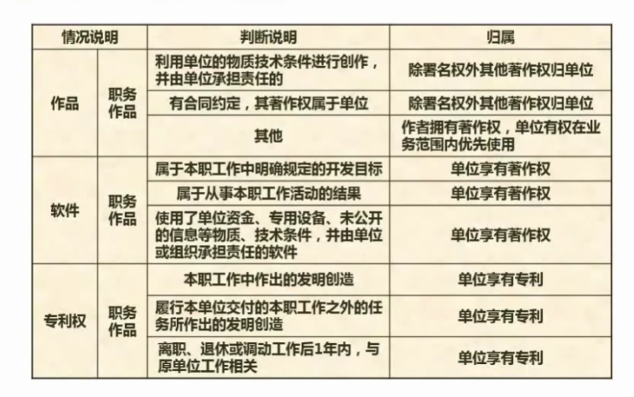
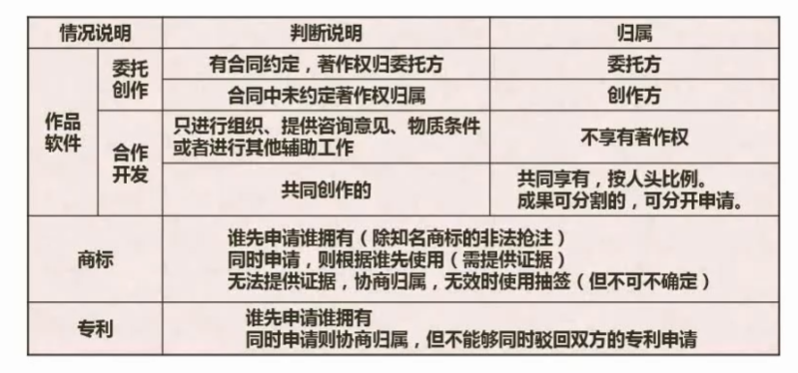
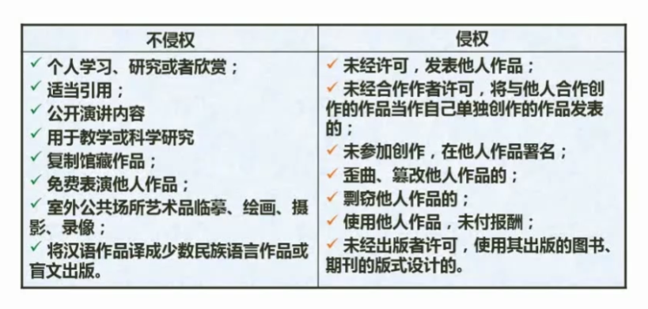

## 09 法律法规

角度：

- 法律法规：著作权法，计算机保护条例、商标法、专利法
- 试题分布：保护期限、知识产权人确定、侵权判断

知识产权:

著作权及邻接权、专利权、工业品外观设计权、商标权、地理标志权、集成电路布图设计权。

## 1. 保护期限

## 3. 知识产权

## 4. 侵权判定

中国公民，法人或者其他组织的作品，无论是否发表，都享有著作权。

开发软件所用的思想，处理过程、操作方法或者数学概念不受保护

著作权法不适用情形：

- 法律、法规，国家机关的决议、决定、命令和起他具有立法、行政、私法性质的文件，及其官方正式译文；
- 时事新闻；
- 历法、通用数表、通用表格和公式

## 5. 标准分类

国际标准：ISO、IEC国际标准化组织

国家标准：GB——中国，ANSI——美国，BS——英国，JIS——日本

区域标准：PASC——太平洋地区标准，CEN——欧洲标准，ASAC——亚洲标准

行业标准：GJB——中国军用标准，MIT-S——美军标准，IEEE——美国电器电子歇会

地方标准：国家的地方以及行政机构

企业标准：

项目规范：

## 6. 标准编号

国际、国外标准代号：标准代号+专业类号+顺序号+年代号

国内标准代号：强制标准代号GB，推荐性标准代号GB/T，指导性标准代号GB/Z、实物标准代号GSB

行业标准代号：汉语拼音大写字母

地方标准代号：DB+升级区划代码前两位

企业标准代号：Q加上企业代号

