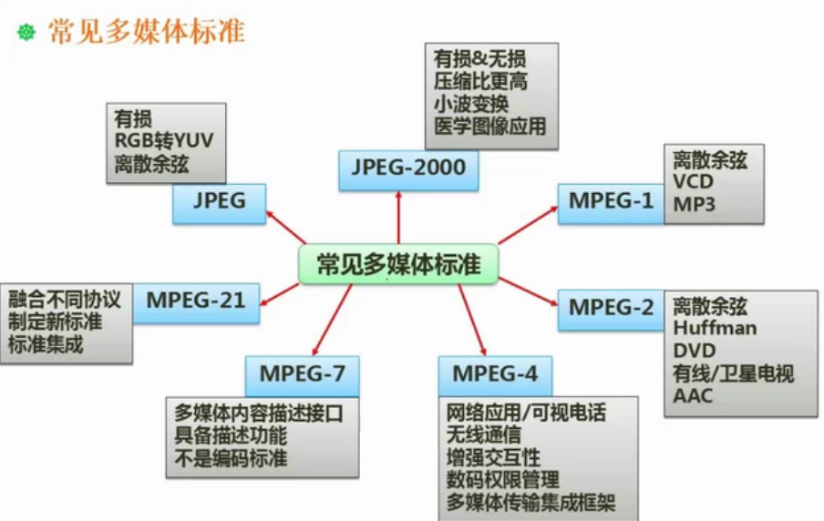

# 10 多媒体基础

## 1. 音频

声音的带宽

- 人耳：20HZ-20kHZ
- 说话：300~3400
- 乐器：20~20kHZ

采样：

- 采样频率
- 采样精度
- 采样频率应为声音最高频率的2倍

## 2. 图像

亮度：

色调：类似色温

饱和度：越高越鲜艳

三原色：RGB（彩色显示器）、YUV（兼容黑白电视方案）、CMY（印刷空间的色彩方案，cmyk）、HSV

## 3 媒体种类

感觉媒体：指人们接触信息的感觉形式。如：视觉、听觉、触觉、嗅觉和味觉等。 

表示媒体：指信息的表示形式。如：文字、图形、图像、动画、音频和视频等。 

显示媒体（表现媒体）：表现和获取信息的物理设备（输入输出设备）。如：输入显示媒体键盘、 鼠标和麦克风等；输出显示媒体显示器、打印机和音箱等。

存储媒体：存储捌居的物理设备，如磁盘、光盘和内存等。 

传输媒体：传输划居的物理载体，如电缆、形览和交换设备等。 

## 4. 多媒体计算

图像容量计算：

- 已知像素、位数：每个像素16位，图像为640*480。容量：640×480×16÷8=614400B
- 已知像素、色数：图像为640*480，256色，容量：640×480×log_2(256)÷8=307200B

音频容量计算：

- 容量=采样频率(Hz)×量化/采样位数×声道数÷8

视频容量计算：

- 容量=每帧图像的容量×每秒的帧数×时间+音频容量×时间

🌰

128Mb空间，拍摄分辨率1600×1200，颜色深度24，可以存储（）张

> 1600×1200×24÷8÷1024÷1024=5.493，128÷5.493≈23.3

CD声音采样频率44.1kHz，样本精度16bit，双声道立体声，数据传输速率为（）

> 44.1×16×2=1411.2kb/s

视频每帧数据量6.4Mb，速率30帧/s，10s的数据量（）

> 6.4×30×10=1920Mb

## 5. 常见的多媒体标准

## 6. 数据压缩

压缩的前提是存在冗余

空间、时间、视觉、信息熵、结构冗余、知识冗余

有损压缩：

无损压缩：霍夫曼编码（变长编码）

