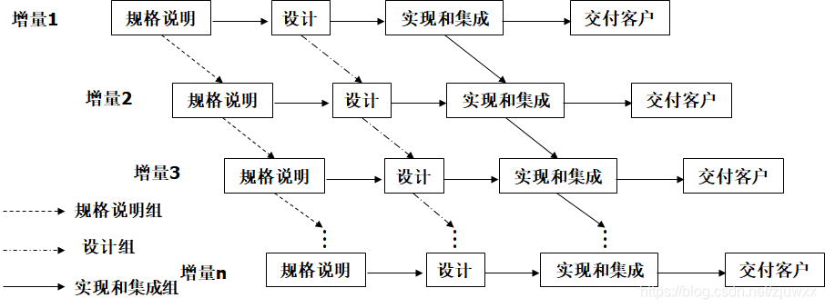
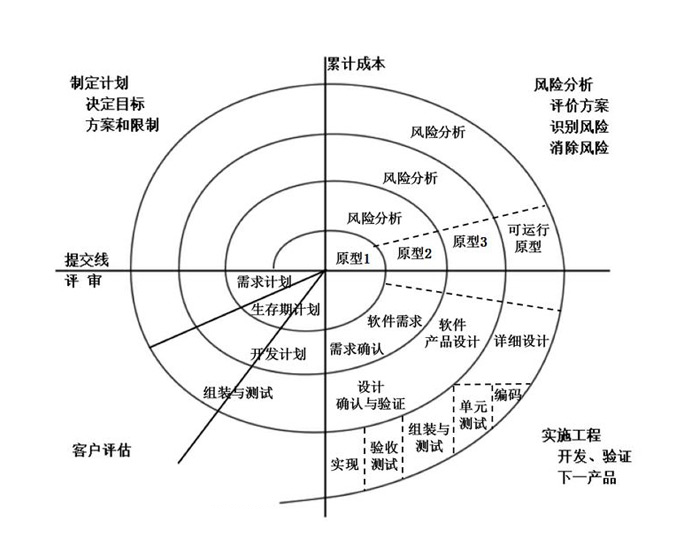
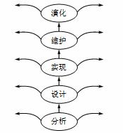
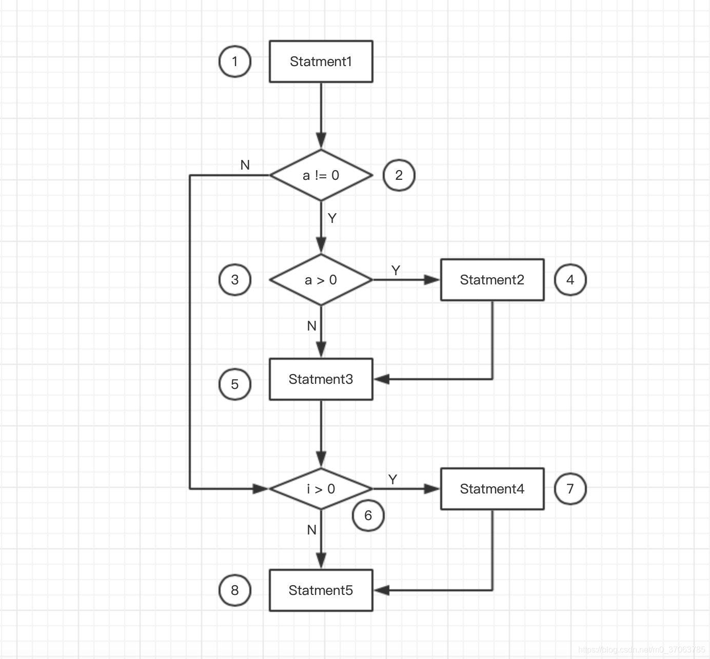

# 11 软件工程

瀑布模型、演化模型、增量模型、螺旋模型、快速原型模型、喷泉模型、v模型

## 1. 瀑布模型

软件计划、需求分析、软件分析、程序编码、软件测试、运行维护

瀑布模型有四个错误假设：

1. 只要花时间，就能明确需求
2. 再开放过程中，需求的改动是非常小的
3. 系统在交付前会顺利地集成
4. 只要计划妥善，项目就可以按时交付

瀑布模型无法有效应对需求变化

## 2. 增量模型

[参考地址](https://blog.csdn.net/zjuwxx/article/details/97308688)

增量模型也称渐增模型。使用增量模型开发软件时，把软件产品作为一系列的增量构件来设计、编码、集成和测试。

> 使用该方法将不同的构件并行构建，可能加快工程进度，但将冒构建无法集成到一起的风险



## 3. 螺旋模型

[参考地址](https://www.itcast.cn/news/20201008/15522827061.shtml)

螺旋模型由巴利·玻姆(Barry Boehm)于1988年提岀，该模型融合了瀑布模型、快速原型模型，它最大的特点是引入了其他模型所忽略的风险分析，如果项目不能排除重大风险，就停止项目从而减小损失。这种模型比较适合开发复杂的大型软件。

螺旋模型将整个项目开发过程划分为几个不同的阶段，每个阶段按部就班地执行，这种划分方式采用了瀑布模型。每个阶段在开始之前都要进行风险评估，如果能消除重大风险则可以开始该阶段任务。在每个阶段，首先构建软件原型，根据快速原型模型完成这个迭代过程，产出最终完善的产品，然后进入下一个阶段，同样下一个阶段开始之前也要进行风险评估，这样循环往复直到完成所有阶段的任务。



1. 制订计划:确定软件目标，制订实施方案，并且列出项目开发的限制条件。

2. 风险分析:评价所制订的实施方案，识别风险并消除风险。

3. 实施工程:开发产品并进行验证

4. 客户评估:客户对产品进行审核评估，提出修正建议，制订下一步计划。

## 4. V模型（是瀑布模型的进阶）

- 明确的标注了测试过程中存在不同的测试类型，明确的表示出了开发阶段与测试各阶段的对应关系
- 单元测试是否满足详细设计的要求
- 集成测试验证之前已测试过的部分是否可以很好的结合在一起
- 系统测试检测系统功能，性能的质量特性是否达到系统要求的指标
- 验收测试确定软件的实现是否满足用户需求或合同要求

在需求阶段就设计了对应的测试计划，强调提早测试，尽早测试

```
用户需求                             验收测试
   需求分析                      系统测试
       概要设计              集成测试
           详细设计      单元测试
                   编码
```


## 5. 喷泉模型

喷泉模型是一种以用户需求为动力，以对象为驱动的模型。主要用于描述面向对象的软件开发过程。该模型认为软件开发过程自下而上周期的各阶段是相互重叠和多次反复的，就像水喷上去又可以落下来，类似一个喷泉。各个开发阶段没有特定的次序要求，并且可以交互进行，可以在某个开发阶段中随时补充其他任何开发阶段中的遗漏。



喷泉模型主要用于面向对象的软件项目，软件的某个部分通常被重复多次，相关对象在每次迭代中随之加入渐进的软件成分。各活动之间无明显边界，例如设计和实现之间没有明显的边界，这也称为“喷泉模型的无间隙性”。由于对象概念的引入，表达分析、设计及实现等活动只用对象类和关系，从而可以较容易地实现活动的迭代和无间隙。

## 6. RAD（快速应用程序开发）

类似VB语言，拖动组件那种

1. 业务建模：通过回答以下问题来定义业务职能之间的信息流：诸如哪些数据驱动了业务流程, 生成了哪些数据, 生成了哪些数据, 信息去向何处, 由谁处理等等。

2. 数据建模：将从业务建模中收集的数据完善为支持业务所需的一组数据对象(实体)。标识属性(每个实体的字符), 并定义这些数据对象(实体)之间的关系。

3. 流程建模：转换数据建模阶段中定义的信息对象, 以实现实现业务功能所需的数据流。创建处理说明以添加, 修改, 删除或检索数据对象。

4. 应用程序生成：使用自动化工具来简化软件的构建；即使他们使用第四种GL技术。

5. 测试和周转：自RAD强调重用以来, 许多编程组件已经过测试。这样可以减少总体测试时间。但是新部分必须经过测试, 并且所有接口都必须充分行使。

## 7. 构件组装模型（CBSD）

需求分析与定义、**软件架构设计**、构件库的建立、应用软件构建、测试与发布


## 8. 统一过程

### 8.1 特点：

- 用例驱动：所有的用户和用例组合在一起就是用例模型，它描述了系统的全部功能。
  - 用户：软件系统是为了解决用户的需求的，因此对于一个系统必须首先确定它的用户（User），即参与者。这个User不仅仅指人，也可以是其他系统。即用户是与系统进行交互的事物。
  - 用例：是用户对系统的业务需求，即用例是能够像用户提供有价值结果的系统中的一种功能。
- 以构架为中心：软件构架包含了系统中最重要的静态和动态特征。**构架刻画了系统的整体设计，去掉了细节部分，突出了系统的重要特性**
  - 用例与构架：每一种产品都具有功能和表现形式两个方面，**其中功能与用例相对应，表现形式与构架相对应**。因此**用例在实现时必须适应于构架**，然而随着系统的发展，用例也在不断的进化，所以**构架必须设计得使系统能够进化**，不仅要考虑系统的初始开发，而且要考虑将来的发展。
  - 构架的步骤：
    1. 从不是专门针对用例的那部分架构开始
    2. 着手处理已经确定重要的用例子集，这些用例代表着即将开发系统的主要功能
    3. 迭代这个工程直到确信得到一个稳定的构架为止

- 迭代和增量的过程

  - 迭代：工作流中的步骤；
  - 增量：产品中增加的部分。

  迭代的原则：**迭代过程必须是受控的（Controlled）**

  如何确定迭代过程中要实现的目标：

  - 迭代过程就是用来处理一组用例的
  - 迭代过程要解决最突出的风险问题

**迭代的过程是什么？**
**以选定的构架为向导，用构件来实现设计前期已经标识并详细描述好的有关用例**。如果一次迭代达到了目的，就可以进入下一次迭代，如果一次迭代没有带到预期的目标，那么必须重新审核前面的方法，并尝试一种新的方法。

**对增量的理解**
一个增量不一定是对原有制品的增加，在生命周期初始期，增量是对最初简单设计的完善和改进；而在以后的阶段增量通常是对原有制品的增加。

### 8.2 阶段及核心任务

**迭代**分为四个阶段：**初始**、**细化**、**构造**和**移交**。

迭代的每个阶段通常又进一步细分为多次迭代过程，**一次典型的迭代阶段（初始、细化、构造、移交）都要经历多种工作流：需求、分析、设计、实现和测试**。

**里程碑**的关键用途是能够帮助管理人员在进入下一个阶段之前据此作出某些意义重大的决定。还可以跟踪每个阶段所投入的时间和其他开销。

主要任务：

**初始阶段（inception phase）**
主要回答下列问题：

- 系统向每个主要用户提供什么基本功能？（确定参与者和用例）
- 该系统的基本粗略构架是什么？（包括主要子系统的大致轮廓）
- 开发该产品的计划是什么？
- 开销多大？（可行性分析）

这个阶段最主要的是确定项目的风险及其优先次序，并对细化阶段进行详细规划和对整个项目进行粗略计算。

**细化阶段（elaborattion phase）**
根据主要的用例描述设计出详细的系统构架。构架包括了用例模型、分析模型、设计模型、实现模型（包含一些构件）和实施模型的视图。
这个阶段主要是解决用例、构架和计划是否足够稳定可靠，风险释放得到充分控制，以便能够按照合同的规定完成整个开发任务。

**构造阶段（construction phase）**
将构造出最终产品。

**移交阶段（transition phase）**
包括产品进入beta版后的整个阶段。开发人员改正用户报告产品的缺陷和不足。


## 9. 敏捷开发

**敏捷开发**（Agile）是一种以人为核心、迭代、循序渐进的开发方法。

在敏捷开发中，软件项目的构建被切分成多个子项目，各个子项目的成果都经过测试，具备集成和可运行的特征。

敏捷开发并不追求前期完美的设计、完美编码，而是力求在很短的周期内开发出产品的核心功能，尽早发布出可用的版本。然后在后续的生产周期内，按照新需求不断迭代升级，完善产品。

**分类**

敏捷开发的实现主要包括 SCRUM、XP（极限编程）、Crystal Methods、FDD（特性驱动开发）等等。

**基本原则**

短平快会议、小型版本发布、较少的文档、合作为重、客户直接参与、自动化测试、适应性计划调整、结对变成、测试驱动开发、持续集成、重构

**四大价值观**

沟通、简单、反馈、勇气

**五大原则**

快速反馈、简单性假设、逐步修改、提倡更改、优质工作

**最佳实践**

计划游戏、小型发布、隐喻、简单设计、测试先行、重构、结对编程、集体代码所有制、持续集成、每周40小时、现场客户、编码标准


## 10. 信息系统开发方法

结构化方法

原型法

- 应对需求不明确的开发，一般通过演示来探明需求

面向对象方法

- 更好的复用性
- 全面、合理、统一的模型
- 分析、设计、实现三个阶段，界限不明确

面向服务方法

面向服务方法是在面向对象方法的基础上扩展的构建系统的思想和方法。面向服务方法关注的是企业业务，它直接映射到业务，强调IT与业务的对齐，以服务为核心元素来封装企业的业务流程和企业已有应用系统。服务的粒度更大，更加匹配企业级应用中的业务，可以实现更高级别的重用。但目前存在相关标准未统一、应用案例较少等一些问题。


## 11. 需求分类

业务需求、用户需求、系统需求

功能需求、性能需求、设计约束

基本需求、期望需求、兴奋需求


## 12. 结构化设计

**原则**

1. 分而治之：将大型复杂的问题分解成许多容易的小问题，软件的体系设计，模块化设计都是分而治之的具体策略。

2. 模块独立性：指软件系统中每个模块只设计软件要求的具体子功能，与软件系统中其他模块的借口是简单的。耦合性越高，模块独立性越若弱。

3. 提高抽象层次：抽象是指护士一个主题中与当前目标无关的方面，以便更注意与当前目标有关的方面。软件设计时，尽量提高软件的抽象层次，按抽象级别从高到低进行软件设计，将软件的体系结构，按自顶向下方式，对各个层次的过程细节和数据细节逐层细化，直到用程序设计的语句能够实现为止。当然实现这个过程需要我们对软件的接口，模块的运行等等有足够的熟悉。

4. 复用性设计：指在构造新的软件的时候，不必从零做起，可以直接使用已有的软构件即可组装成新的系统。

5. 灵活性设计：引入灵活性的方法有，降低耦合并提高内聚（易于提高替换功能）；建立抽象（创建有多态操作的接口和父类）；不要将代码写死（消除代码中的常数）；抛出异常（由操作的调用者处理异常）；使用并创建可复用的代码。


## 13. 软件测试

**测试原则**

- 尽早、不断地测试

- 避免测试自己的程序

- 合理、有效的数据+无效、不合理的数据

- 修改后应进行回归测试

- 尚未发现的错误数量与已发现的错误成正比

**动态测试**：黑盒、白盒、灰盒

**静态测试：**桌前检查、代码走查、代码审查


## 14. 测试用例

**黑盒测试**

- 等价类划分
- 边界值分析
- 错误推测
- 因果图

**白盒测试**

- 基本路径测试
- 循环覆盖测试
- 逻辑覆盖测试：语句、判定、条件、条件判定、修正的条件判定、条件组合、点覆盖、边覆盖、路径覆盖

## 15. 测试阶段

- 冒烟测试（初步测试）

- 单元测试
- 集成测试
  - 一次性组装、增量式组装
- 确认测试
  - 内部确认测试（与需求匹配）、Alpha测试、Beta测试、验收测试（用户参与）
- 系统测试
  - 恢复测试、安全性测试、压力测试、性能测试、可靠性测试、可用性测试、可维护性测试、安装测试

其中性能测试有：负载测试（不同负载的表现）、强度测试（系统异常的情况）、容量测试


## 16. McCabe复杂度

计算有向图的环路复杂公式$V(G)=m-n+2$，

其中V(G)是G的环路个数，m是有向弧，n是节点数

🌰：O→O→O，节点是3，m是2，G是2-3+2=1

程序流程图转为有向图：分支可以抽象为节点

[参考链接](https://blog.csdn.net/m0_37063785/article/details/88784913)

(2016年上半年试题)对下图所示流程图采用白盒测试方法进行测试，若要满足路径覆盖，则至少需要（）测试用例。采用McCabe度量法计算该程序对环路复杂性为（）。



上图中一共有6条路径：12345678，1234568，1235678，123568，12678，1268。
根据McCabe度量法环路复杂性公式V(g)=m-n+2,图中m=10,n=8,V(g)=10-8+2=4。

## 17. 软件维护

软件维护是生命周期的一部分，确保系统能够正常的运行。

可维护性：

- 易分析性
- 易改变性
- 稳定性
- 易测试性

维护类型：

- 改正性维护
- 适应性维护
- 完善性维护
- 预防性维护

## 18. 软件项目管理

### 18.1 软件配置管理

软件配置管理的主要目标是：标识变更、控制变更、确保变更正确实现、报告有关变更

#### 1. 基线

软件生存周期各开发阶段的一个特定点，使开发阶段划分明确。可以作为一个检查点，采用的基线发生错误时可以知道所处的位置，返回到最近和最恰当的基线上。

#### 2. 软件配置项

软件配置项是软件工程中产生的信息项，它是**配置管理的基本单位**。

1. 系统规格说明书；
2. 软件项目实施计划；
3. 软件需求规格说明书；
4. 设计规格说明书；
5. 源代码清单；
6. 测试计划和过程、测试用例、测试结果；
7. 操作和安装手册；
8. 可执行程序；
9. 数据库描述；
10. 用户手册；
11. 维护文档；
12. 软件工程标准；
13. 项目开发小结；

#### 3. 版本控制

软件的每一个版本都是SCI的一个汇集；

#### 4. 变更控制

变更均会引起软件配置的变更，这种变更必须严格地加以控制，保持修改信息。为了实现有效变更，需要借助于配置**数据库和基线**的概念。

**配置数据库**包括：

1. 开发库：供开发人员使用，其中的信息可能频繁修改，对其控制相当宽松；
2. 受控库：在生存期某一阶段工作结束时发布的阶段产品，也成为软件配置库；
3. 产品库：开发的软件产品完成系统测试后，作为最终产品交付。


