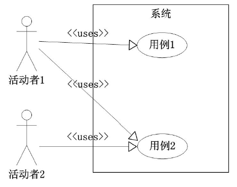
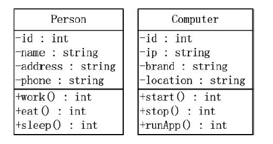
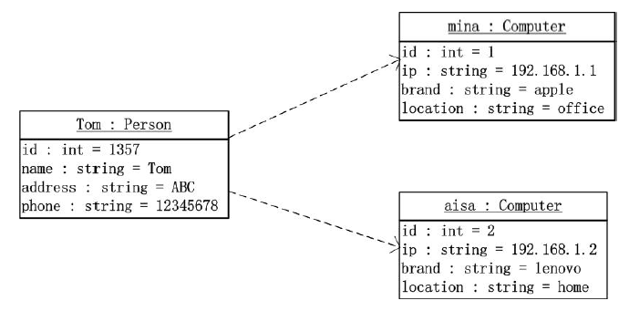
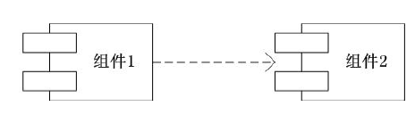
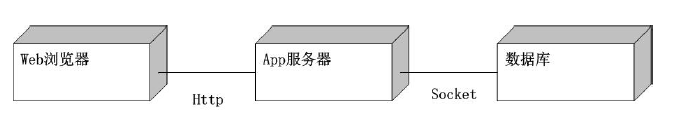
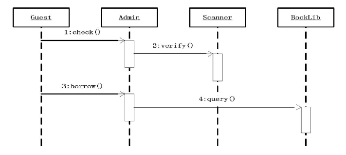
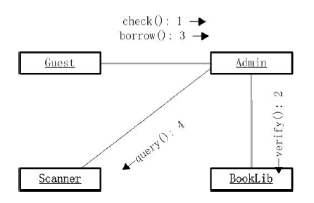
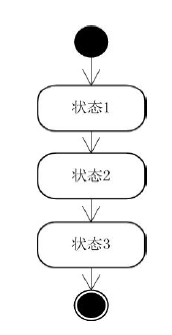
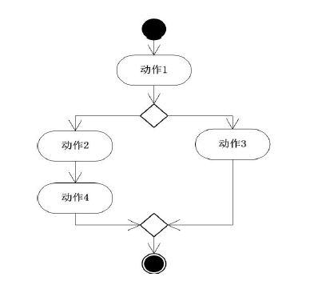

# 14 统一建模语言

UML式**面向对象软件的**标准化建模语言，目前是**可视化建模语言**的工业标准。

UML中的词汇表包含了3种构造块：事物、关系和图；**关系把事物结合在了一起，图聚集了相关的事物**。

事物：

- 结构事物：UML模型中的名词，通常是模型的静态部分。包括：类、接口、协作、用例、主动类、构件、制品和结点
- 行为事物：UML模型中的动词，是模型的动态部分。包括：交互、状态、活动
- 分组事物：UML模型的组织部分，最主要的分组事物是**包**
- 注释事物：UML模型的解释部分，描述、说明和标注模型的任何元素

关系：

- 依赖：两个事物间的语义关系，其中一个事物发生变化会影响另一个事物的语义。
- 关联：关联是一组结构关系，描述了一种链，链是对象之间的连接。聚集是一种特殊类型的关联，描述了整体和部分的结构关系
- 泛化：一种特殊/一般关系，特殊元素的对象可以替代一般元素（其实就是**继承**）
- 实现：类元之间的语义关系，其中一个类元指定了另一个类元保证执行的契约

图：

## 1. 基本的UML图

### 1.1 用例图

用例图展示了系统的核心功能及其交互的用户。用户用**人形图标**标注，用例使用**椭圆**标注。用例图限定了系统边界，用例应该**绘制在边界内**，用户在**边界外**。

### 1.2 类图

类图表示类的特征，内容包括：类名、属性、操作。属性和操作前面的+-表示可见性。

### 1.3 对象图

表现对象的特征，展示多个对象的特征及对象之间的交互。

### 1.4 组件图

组件图表示软件组件之间的关系，组件用带有凸出的矩形标志表示。

### 1.5 部署图

用于表示部署软件应用的**物理设备信息**。

### 1.6 时序图

时序图**捕捉一段时间范围内**，多个对象之间的交互信息。强调消息交互的时间顺序。

### 1.7 协作图（通信图）

协作图表示一定范围内对象之间的协作的信息，强调与信息交流的对象之间的组织结构。

### 1.8 状态转换图

描述一个对象在不同的事件触发时，其内部状态的转变过程。状态转换图由**状态和转换**组成。

### 1.9 活动图

活动图表示活动的流程，实心圆点和外围带圈的实心圆点分别代表活动开始和结束。

### 1.10 包

包是一组相关实体，用于划分类的命名空间。用于命名，成员可见度，导入，继承，泛化。

